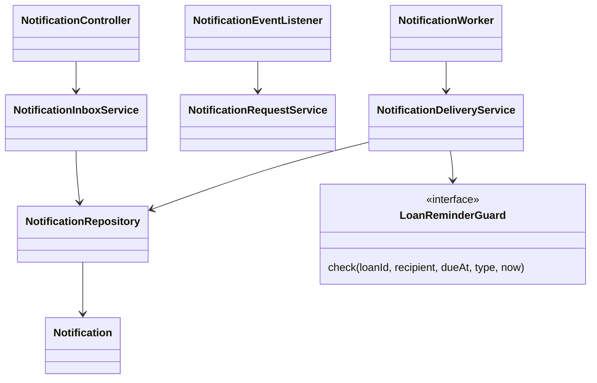

# UC 05 notification design



```mermaid
sequenceDiagram
 participant Producer as Loan or maintenance service
 participant Listener as Synchronous event listener
 participant DB as Shared database
 participant Worker as Delivery worker
 participant Guard as Loan adapter
 Producer->>DB: Begin business transaction
 Producer->>Listener: NotificationRequested
 Listener->>DB: Insert request once (unique key)
 Producer->>DB: Commit business change and request
 Worker->>DB: Select bounded due requests
 Worker->>Guard: Lock Equipment and Loan; revalidate
 Worker->>DB: Lock and refresh notification
 alt No longer applicable
 Worker->>DB: Cancel and record reason
 else Temporarily unavailable
 Worker->>DB: Record retry or terminal failure
 else Valid
 Worker->>DB: Mark delivered and visible in inbox
 end
 Worker->>DB: Persist attempt and commit
```

The Loan adapter and producers are Sprint 2 integration points. Pure reminder classification is independent of browser rendering and persistence.
