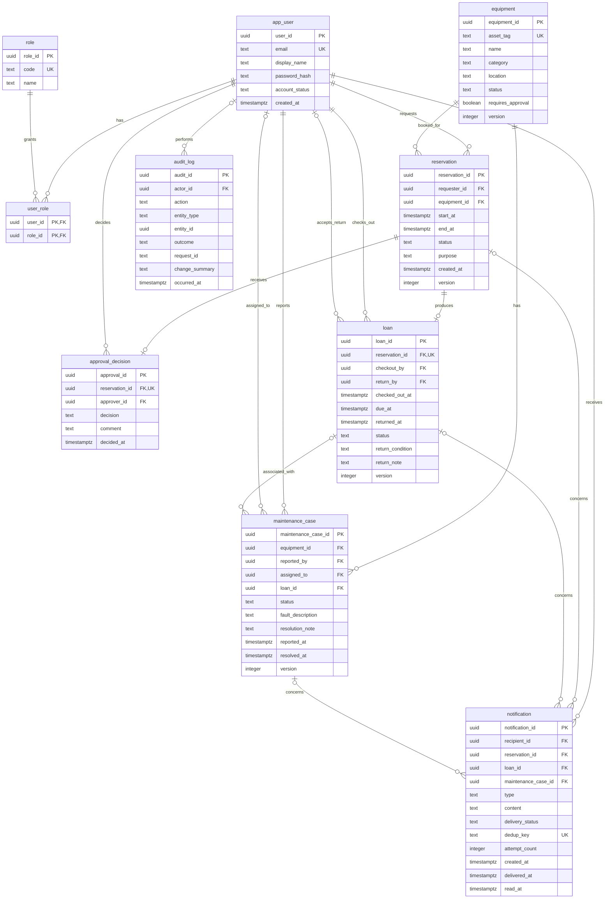
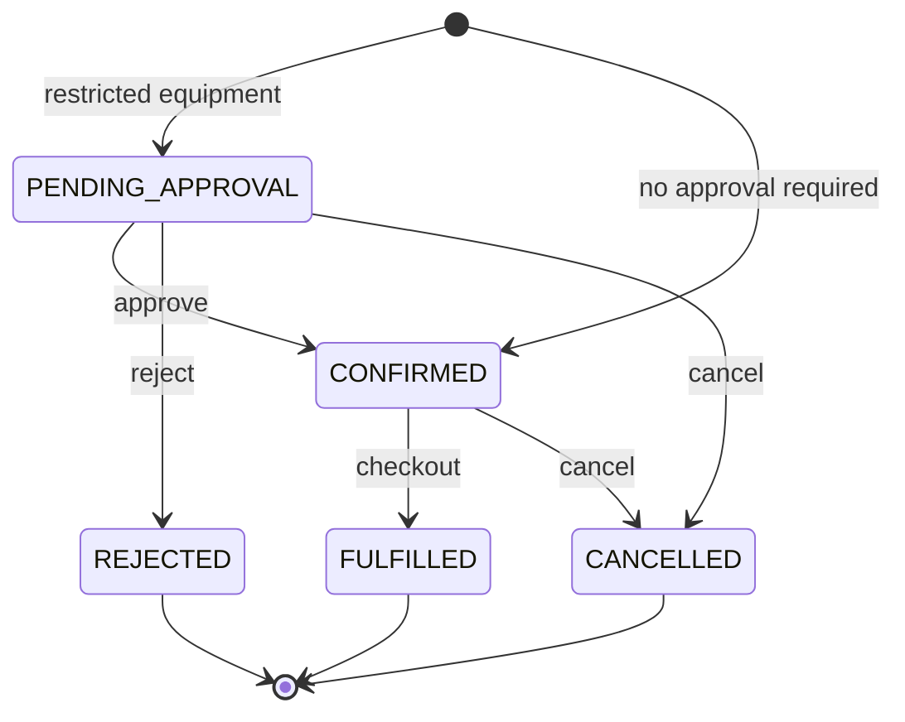
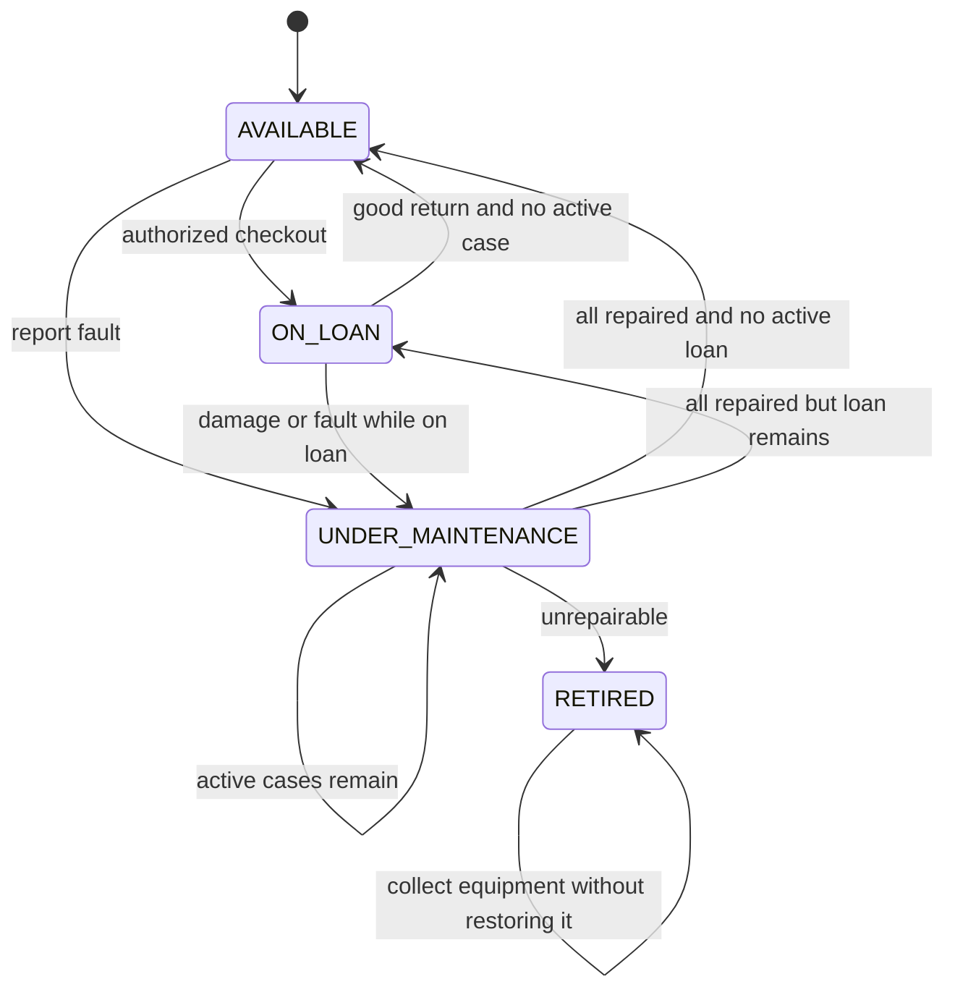
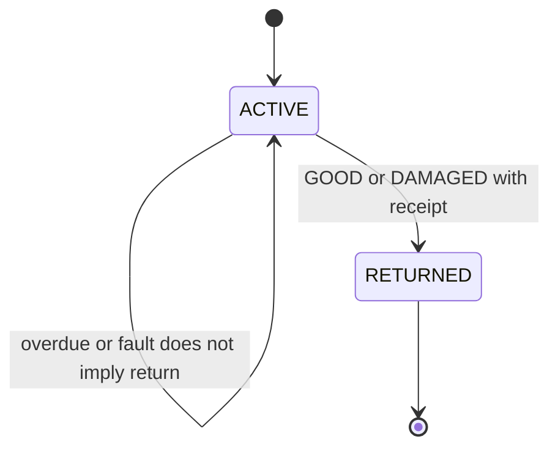
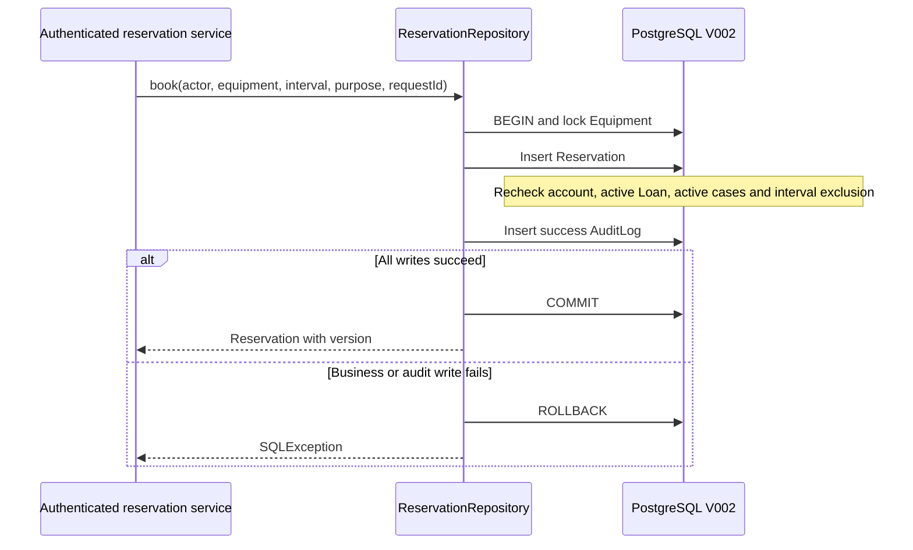

# SERMS 数据库与领域模型

负责人：Zhou Fanhao。当前数据库版本 V002，2026-09-25 根据 SERMS 目录中的 ER 图、分析类图、领还顺序图、状态说明与系统集成说明修订。原始图文的实体和业务规则为本次调整依据，取代 V001 中单角色、简化状态和借出设备不允许预约的暂定设计。

## 参考依据与冲突处理

主要依据：

- `SERMS_Domain_Glossary_and_ERD.md`：十个领域实体、字段、可空性、主外键与关系基数。
- `Diagrams/ER Diagram.png`：逐项核对实体、字段与关联。
- `Diagrams/Class Diagram.png`、`Pickup Sequence Diagram.png`、`Return Sequence Diagram.png`：区分 Borrower 与 Custodian、实际领还记录、审计及损坏归还关联。
- `SERMS_Equipment_and_Loan_States.md` 及设备/借用状态图：使用正式状态代码、维护优先级与不可逆终态。
- `SERMS_System_Integration.md`：预约占位、锁顺序、事务边界、通知去重。
- `English_Deliverables/Domain_Glossary_EN.md` 和 `State_Pattern_Candidate_Final.md`：英文术语与模式职责边界。

中文术语表的冲突公式写成“或”，与集成说明、英文版及相邻时段可预约的要求冲突。本实现以一致的 AND 公式为准：`existing.start_at < requested.end_at AND requested.start_at < existing.end_at`。

`attempt.md` 只有“续租申请”“自批复”两个议题，没有流程或验收条件。当前依照详细状态与集成说明保留无续借、禁止自批；不把讨论标题当成已确认规则。

## 术语与物理映射

| 领域概念 | 数据库表示 | 语义 |
| --- | --- | --- |
| User | app_user | 身份主体；不以 Student/Customer/Borrower 单独建表 |
| Role / UserRole | role / user_role | BORROWER、APPROVER、CUSTODIAN、MAINTAINER、ADMIN；用户可有多个角色 |
| Equipment | equipment | 一条记录是一台独立实物；资产编号唯一 |
| Reservation | reservation | 申请人 requester_id、用途 purpose 和 [start_at,end_at) 时段 |
| ApprovalDecision | approval_decision | 一次不可覆盖的终局决定；一预约最多一条 |
| Loan | loan | 一预约最多一次借用；借用人和设备经 Reservation 追溯 |
| Custodian | loan.checkout_by / return_by | 领还经办人，不能与预约申请人混为一谈 |
| MaintenanceCase | maintenance_case | 可独立报告，也可关联同设备的 Loan |
| Notification | notification | 接收人、唯一业务关联、去重键、投递/重试/阅读信息 |
| AuditLog | audit_log | 追加式业务操作证据；系统任务 actor_id 可空 |
| Overdue | 时间比较 | ACTIVE 且 now > due_at；RETURNED 且 returned_at > due_at 表示曾逾期，不存 OVERDUE 状态 |

保留物理表名 `app_user` 避免 SQL USER 名称冲突；其余字段按 ER 图使用 user_id/equipment_id/reservation_id/requester_id/start_at/end_at 等。账户状态原图未定义枚举取值，本次映射为 ACTIVE、DISABLED（对应旧 active=true/false）。equipment.created_at 和 schema_version 为原有实施字段，额外保留，不改变业务关系。

## 当前 ERD

下图基于原始 ERD 转为物理名称；V002 已创建全部十个业务实体，非仅预留设计。schema_version 和 equipment.created_at 未在原图中展开。

## 已实施的数据约束

| 对象 | V002 约束 |
| --- | --- |
| app_user / role / user_role | 标准化唯一邮箱；角色代码白名单；联合主键阻止重复授权；外键保留历史 |
| equipment | 正式状态白名单；RETIRED 禁止恢复；version 每次更新增加 |
| reservation | 有限且正长度时段；用途；版本；有效占位区间排斥；引用与时间不可任意改写；合法状态转换 |
| approval_decision | 预约唯一；拒绝理由必填；禁止审批申请人自己的预约；决定禁止覆盖或删除 |
| loan | 预约唯一；经办人外键；due_at 必须等于预约结束；一个设备最多一个 ACTIVE 借用（锁设备后检查）；归还字段完整且时间合法；损坏说明必填；已归还结果不可覆盖 |
| maintenance_case | OPEN 起始及合法转换；分派/进行中需 assigned_to；结单有结果和结束时间；关联 Loan 必须属于同设备；可首次关联原先独立的故障工单，但不能更换已有借用关联 |
| notification | 三个业务关联必须恰好一个；dedup_key 唯一；重试计数非负；SENT 才能有 delivered_at/read_at，时间顺序合法 |
| audit_log | 操作者可空，其余关键识别信息必填；禁止 UPDATE/DELETE/TRUNCATE；业务对象多态引用由服务校验 |

全部常规外键使用 RESTRICT，不级联删除历史。版本由触发器增加，应用需使用 `UPDATE ... WHERE id_column=? AND version=?` 并检查受影响行数实现乐观并发控制；单独存在 version 字段不等于自动发现客户端陈旧写入。

## 预约可用性

`PENDING_APPROVAL`、`CONFIRMED`、`FULFILLED` 均占据原预约时段；`CANCELLED`、`REJECTED` 释放占位。提前归还不会缩短原预约。半开区间允许前一预约的结束时刻等于后一预约开始。

UNDER_MAINTENANCE、RETIRED 不接受新预约。AVAILABLE 必须无活动借用和活动工单；ON_LOAN 必须存在尚未逾期的 ACTIVE Loan，申请开始不早于其 due_at，且无活动工单。即使设备状态暂未同步，存在活动工单也会阻止新预约。查询和写入共用 `serms.equipment_can_reserve`，写入时锁设备再次检查。

允许当前尚未结束的预约时段；end_at 必须晚于提交时刻。设备实际交付仍由后续领用服务检查 `start_at <= now < end_at`。时间统一使用 Instant / timestamptz，精度不超过微秒，显示时区由页面负责。

## 状态和事务

设备状态优先级为 RETIRED > 活动工单 > ACTIVE Loan > AVAILABLE。借用中报障或报废不自动结束 Loan；仍可登记收回。逾期与损坏可同时成立，归还时各自保留。维护状态采用 OPEN → ASSIGNED → IN_PROGRESS → RESOLVED/UNREPAIRABLE；终结不重开。

预约创建与取消已通过 Repository 与成功审计原子提交。其他跨实体业务仍由下一阶段 Service 实现：审批决定与预约变化；Loan、设备和预约的领用联动；归还、工单及设备状态重算；通知扫描和重试。数据库约束不代替身份认证、角色授权、现场身份核实、领用窗口或全流程审计。

各模块先锁 Equipment，再锁 Reservation、Loan、MaintenanceCase，多记录按 ID 排序。数据库触发器提供防御性设备锁，但服务仍须从事务开始遵循此顺序，以避免先更新子记录再反向获取设备造成死锁。遇到 40P01/40001 应有限重试完整事务。

## 与原分析模型的对应

LoanDesk 是界面边界，LoanControl 是分析控制对象，设计阶段可落实为 Controller/Service；它们不是数据库实体。图中的 User.roles 对应 user_role，Reservation.requester 对应 requester_id，Loan 中的领还经办人单独持久化；LoanControl 协调 MaintenanceCase 与 AuditLog 的事务，不能让 Entity 自行提交数据库。

State Pattern 仍是候选：按 `State_Pattern_Candidate_Final.md`，若采用，应将允许的操作交给设备状态类，将共同事实校验和目标状态优先级集中在共享规则中。当前仍存枚举状态代码，未实现或宣称已采用 State 类层次。Loan 使用 ACTIVE/RETURNED 即可，不新增 OverdueState。

## 迁移与交接

V001 保留原样；V002 原子重命名、迁移旧角色与状态、创建新表并记录版本 2。旧 TECHNICIAN 转 MAINTAINER，不额外授予权限。旧 FULFILLED 数据如果与其他有效预约重叠，新约束将拒绝整个迁移，需先人工核对；不删除冲突或捏造历史 Loan。

V002 与 Java API 是配套升级：停写、备份、迁移、发布新模块后再开放服务。初始化/升级命令见 [数据库 README](../database/README.md)。真实测试覆盖数据升级和数据库规则，但不代表审批、领还、维护和通知的完整 Service 已实现或已上线。