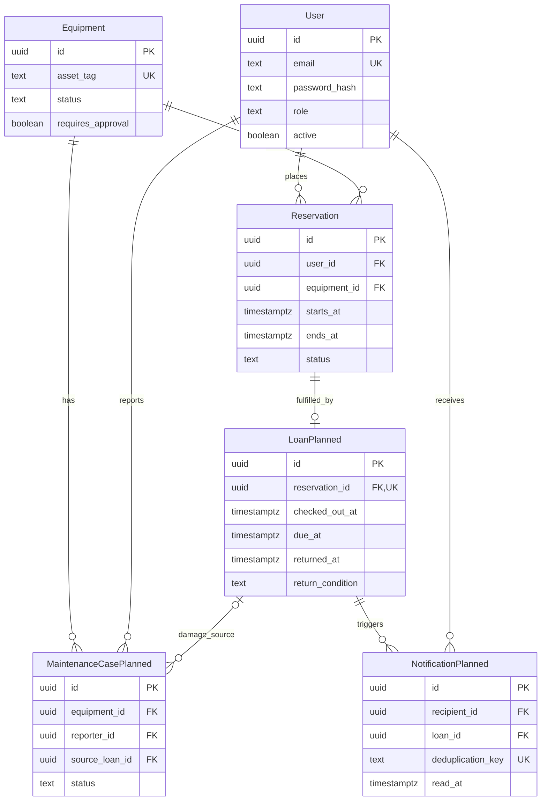
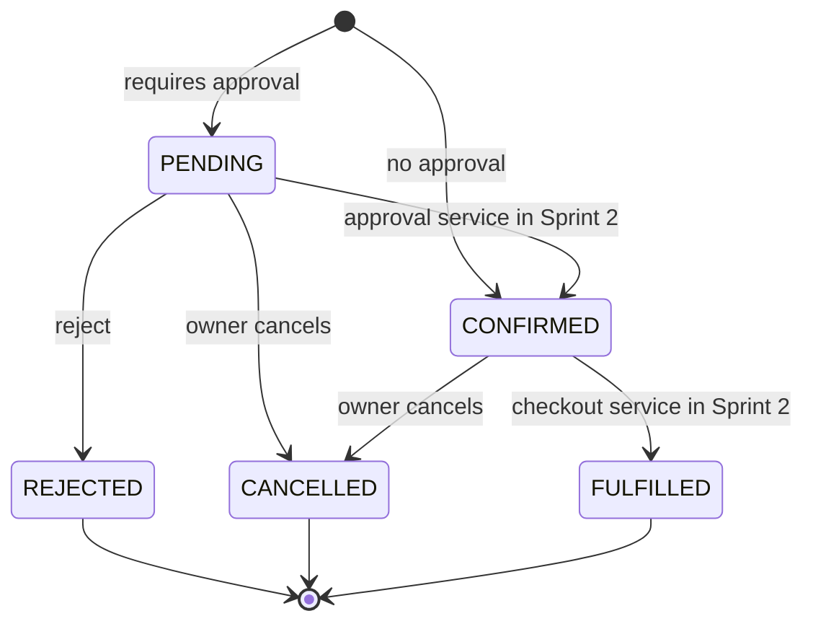
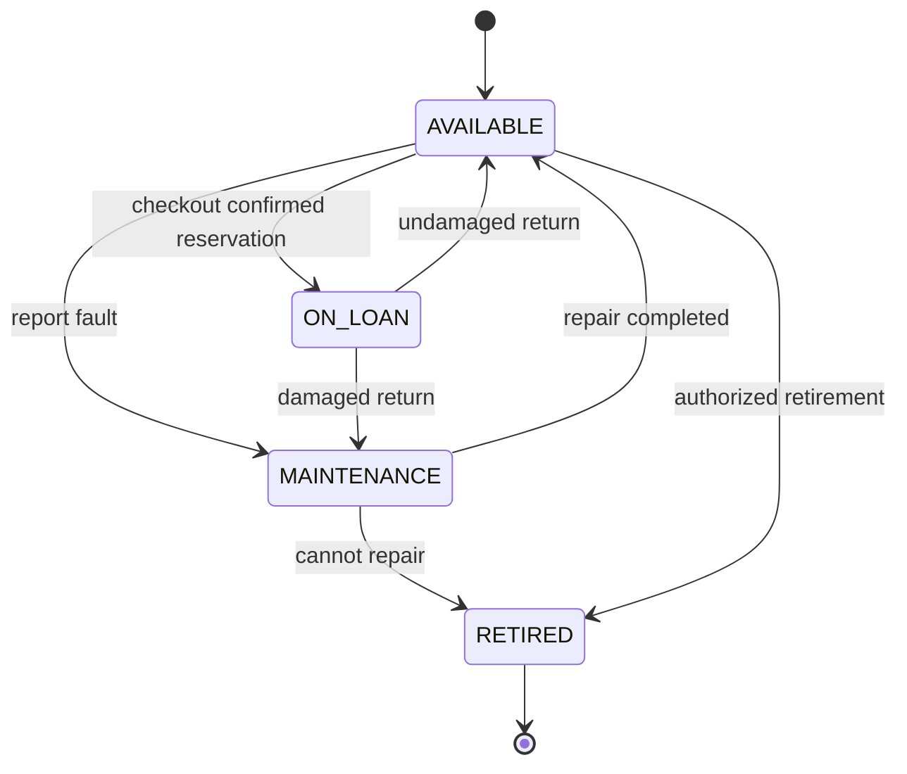
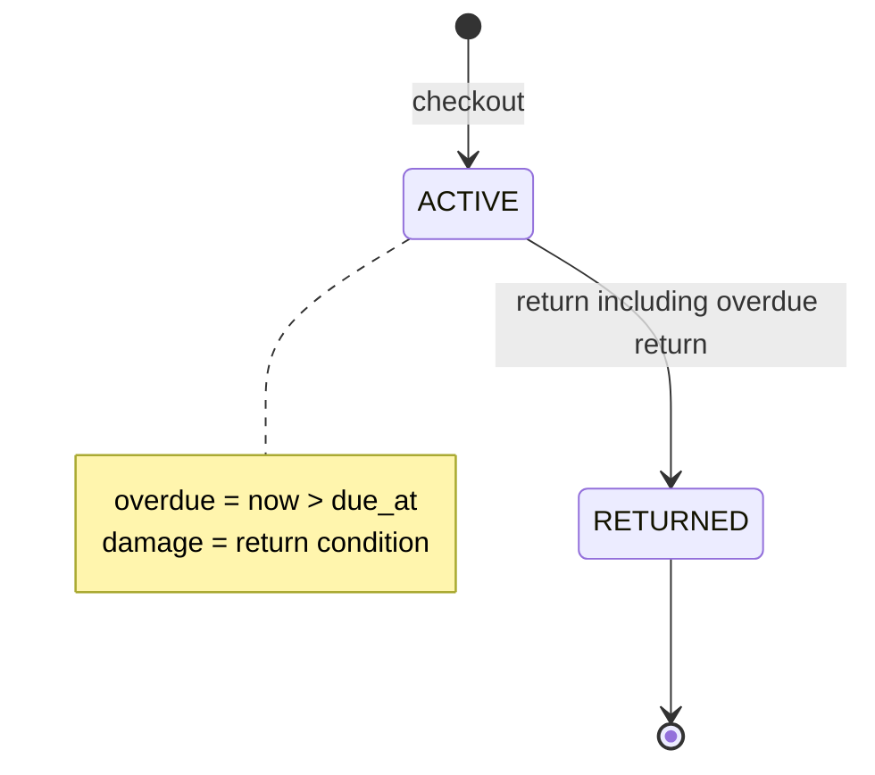
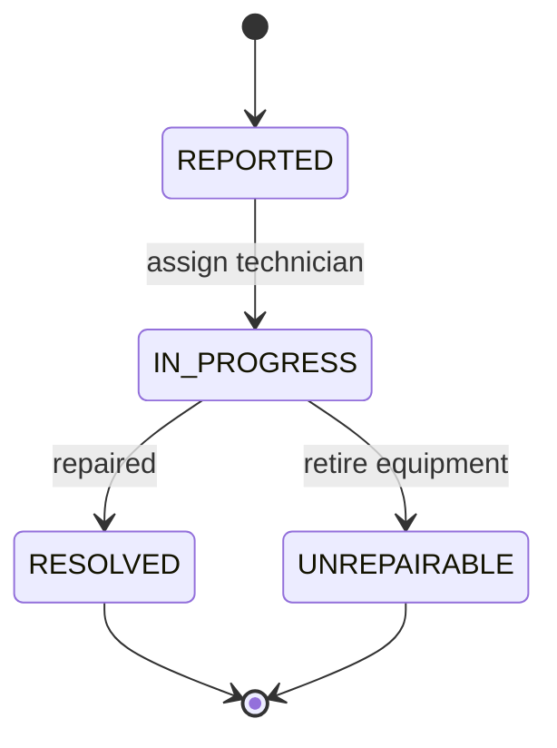
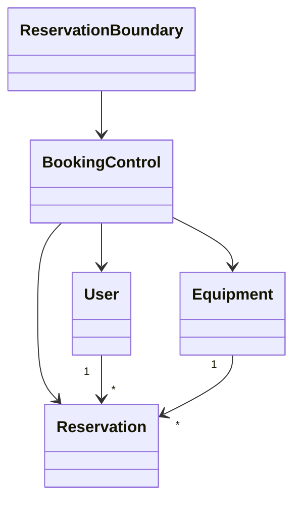
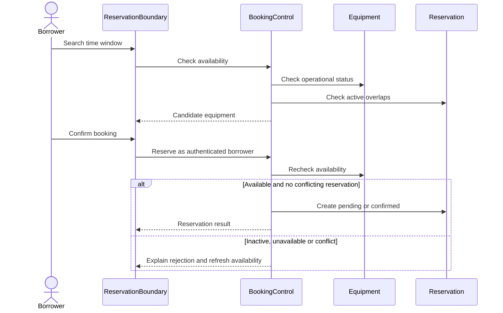
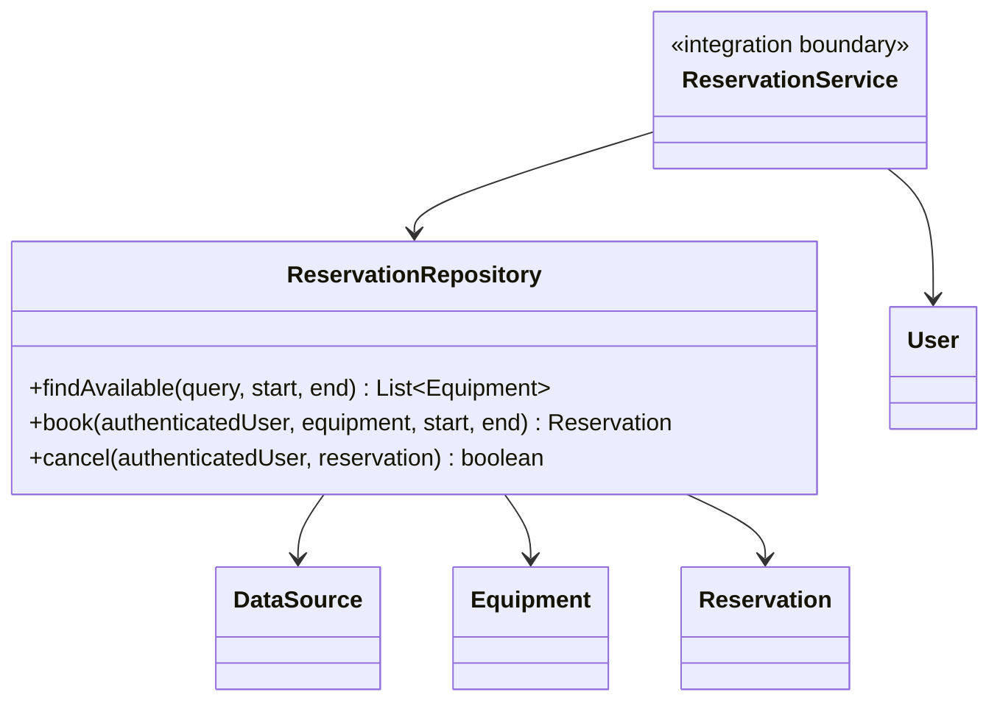
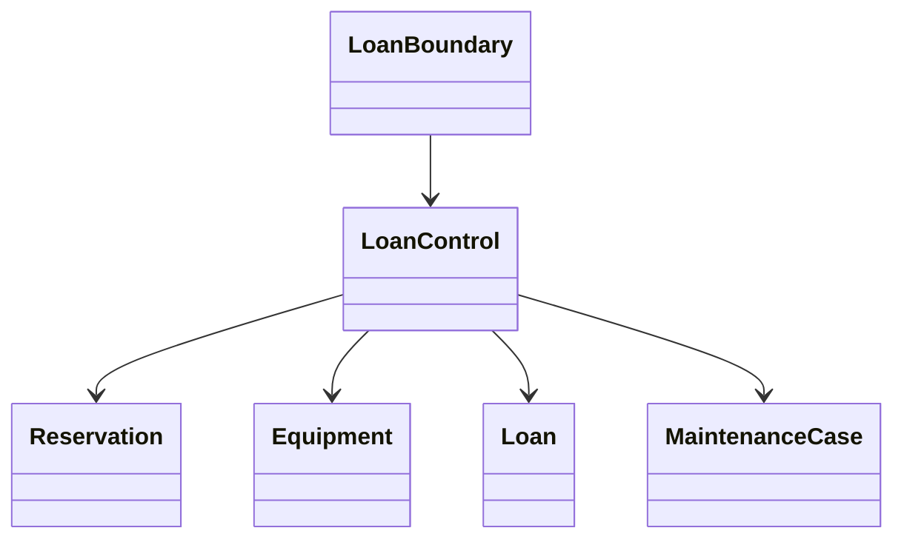
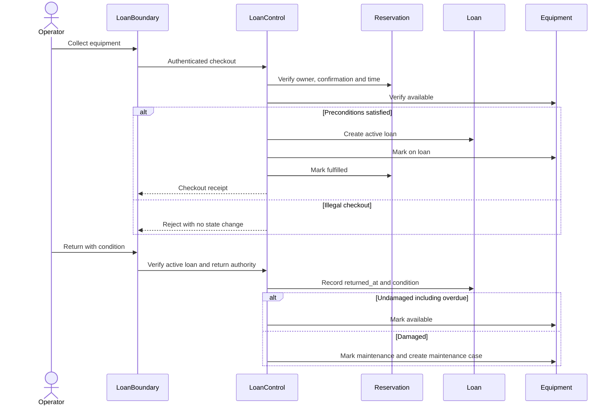

# Sprint 1 领域模型与集成设计

本设计支持 9 月 12 日至 9 月 25 日的预约流程，负责人为 Zhou Fanhao。依据项目计划第 3、4、5.3、7、8 节：本次落地 User、Equipment、Reservation，并为 Loan、MaintenanceCase、Notification 建立统一概念和集成关系。后三者的持久化及业务实现属于 Sprint 2，不在 V001 中创建空表。

## 领域词汇

| 术语 | 含义与边界 |
| --- | --- |
| User / 用户 | 以 UUID 标识的账户，邮箱统一 trim + lowercase；active 控制是否可新建预约 |
| Role / 角色 | BORROWER 借用者、APPROVER 审批人、TECHNICIAN 维护人员、ADMIN 管理员；V001 每人一个角色，多角色需后续迁移 |
| Equipment / 设备 | 一台可独立预约的实物，由唯一 asset_tag 标识；不把多台同型号设备合成一个容量记录 |
| Reservation / 预约 | 用户申请某设备的未来时间区间；预约不是实际借出记录 |
| Availability / 可用性 | 设备可预约且目标区间不与有效预约重叠；属于查询结果，不是设备永久状态 |
| Loan / 借用 | Sprint 2 的实际领用记录，关联一个已确认预约，记录领出、应还和实还时间 |
| MaintenanceCase / 维护工单 | Sprint 2 的设备故障处理记录，可来源于损坏归还；设备进入维护后不能新建预约 |
| Notification / 通知 | Sprint 2 的用户应用内消息，逾期通知需有业务去重键 |
| Overdue / 逾期 | 未归还且当前时间超过 due_at 的派生条件；不能只依赖定时任务维护的布尔值 |
| Active reservation / 有效预约 | PENDING 或 CONFIRMED，占据时间区间；待审批也占位，避免同一时段无限申请 |
| Time window / 时段 | UTC 瞬时语义，精度至微秒，左闭右开 [starts_at,ends_at)，相邻预约不冲突 |

## 数据字典与关系

所有已实现表均在 serms schema 下。标识符由应用生成 UUID，数据库时间戳使用 timestamptz。

| 表 | 字段 | 约束 |
| --- | --- | --- |
| app_user | id, email, display_name, password_hash, role, active, created_at | PK id；email 唯一且标准化；role 白名单；密码只保存外部认证模块生成的哈希 |
| equipment | id, asset_tag, name, category, location, status, requires_approval, created_at | PK id；asset_tag 唯一；必填文字非空；status 白名单 |
| reservation | id, user_id, equipment_id, starts_at, ends_at, status, created_at | PK id；两个 FK 禁止删除被引用对象；有限且正长度时间区间；有效预约不得重叠 |
| schema_version | version, description, installed_at | 与迁移同事务提交的版本记录 |

索引：邮箱与资产编号的唯一索引；预约 user_id + starts_at 用于个人时间线；设备 category + status 用于筛选；GiST 排斥约束索引用于预约区间冲突。包含搜索目前按小规模设备目录实现，无分页接口且最多 100 条；数据量增大时再评估全文/三元组索引与分页契约。

以下 ERD 包含已实现部分及 Sprint 2 规划（实体名带 Planned）。规划属性不是已存在的列。



Loan 通过 Reservation 确定设备和借用人，避免重复外键造成不一致。Sprint 2 必须在领出事务中锁设备并确保一台设备只有一个未归还 Loan；新增 Loan、设备 ON_LOAN、预约 FULFILLED 要原子提交。归还事务更新 Loan、设备状态，损坏时同时生成工单。通知以 loan + recipient + notification type + due/version 组成去重键；规则由通知负责人确认。

## 状态约束

已实现 Reservation 状态转换：插入时由 requires_approval 决定 PENDING/CONFIRMED。PENDING → CONFIRMED/REJECTED/CANCELLED；CONFIRMED → CANCELLED/FULFILLED；终态不能复活。预约设备、用户和起止时间不可原地修改，必须取消后重订。同状态更新允许幂等执行。审批和领出服务尚未实现，数据库状态预留不代表服务已可用。



以下 Equipment、Loan、Maintenance 状态图是 Sprint 2 合法转换设计。V001 仅校验设备状态值并阻止非 AVAILABLE 设备产生新预约，不实现这些跨实体事务。







## Sprint 1 分析与设计追踪

分析类把可用性与预约规则放在业务协调对象上：





设计图中的 Repository、Equipment、Reservation、User 和 SQL 已实现；Controller/Service 为其他负责人接入边界。



```mermaid
sequenceDiagram
    participant Service as Authenticated service (integration boundary)
    participant Repo as ReservationRepository
    participant DB as PostgreSQL
    Service->>Repo: book(sessionUserId, equipmentId, start, end)
    Repo->>DB: BEGIN
    Repo->>DB: SELECT equipment FOR UPDATE
    DB-->>Repo: requires_approval
    Repo->>DB: INSERT reservation
    Note over DB: Trigger checks user and equipment; GiST rejects overlapping active ranges
    alt Valid
        DB-->>Repo: inserted
        Repo->>DB: COMMIT
        Repo-->>Service: Reservation
    else Constraint violation
        DB-->>Repo: SQLSTATE
        Repo->>DB: ROLLBACK
        Repo-->>Service: SQLException
    end
```

## Zhou Fanhao 核心用例的 Sprint 2 设计准备

用例：设备领用和归还。参与者为借用者及授权的发放/接收人员（具体角色映射由 RBAC 负责人确认）。领用前必须预约归本人且为 CONFIRMED，当前时间满足领用窗口，设备可用，无活动借用。成功后创建 Loan，设备为 ON_LOAN，预约为 FULFILLED；重复、越权、已取消、未审批、设备故障或超窗口领用应拒绝且无部分写入。

正常归还关闭 Loan 并释放设备；逾期归还仍接受，保留 due_at 和 returned_at，停止未来逾期提醒；损坏归还关闭 Loan、设备转 MAINTENANCE 并生成维护工单。不存在、已归还或越权操作应返回清晰结果，重复提交不得新建第二张工单。审核权限和领用时间容差尚需团队确认。





State Pattern 候选问题：直接在多个 Controller 写 if/else 会让合法转换和副作用分散。Sprint 1 状态简单，采用枚举加集中数据库校验，保留最小实现。Sprint 2 可比较集中转换表与 State 对象：前者容易审计；后者适合状态具有多种行为时，但增加类数。若选择 State，应由 LoanService 在事务中委托状态对象，Repository 保存结果；跨对象原子性、锁和数据库约束仍须保留。当前没有将候选模式宣称为已实现。

## 集成关系与待确认决策

1. Shi Wenqi：服务使用本模块的查询与预约接口，冲突映射为 409；前端仍需实现并接入认证。
2. Zhang Hanming：审批只允许授权用户执行；批准前重检规则；共同 Review 测试与角色边界。
3. Liu Tongyao：维护状态更新必须锁同一设备；已有预约的取消/重排及通知在同一业务流程协调。
4. Wang Yuanmeng：配置 DataSource 和 Service 分层；逾期读取 Loan，通知进行幂等处理。
5. Zhou Fanhao：后续增加 Loan 迁移、领出/归还原子事务及状态模式验证。

暂定决策：PostgreSQL 17、Java 17、每人单角色、待审批占位、所有启用账户可经服务申请、借出设备暂停接受新预约。需要团队 Review 确认；不推定项目名称已获老师确认。源文件为本 Markdown 内的 Mermaid，可编辑且可在支持 Mermaid 的页面渲染。