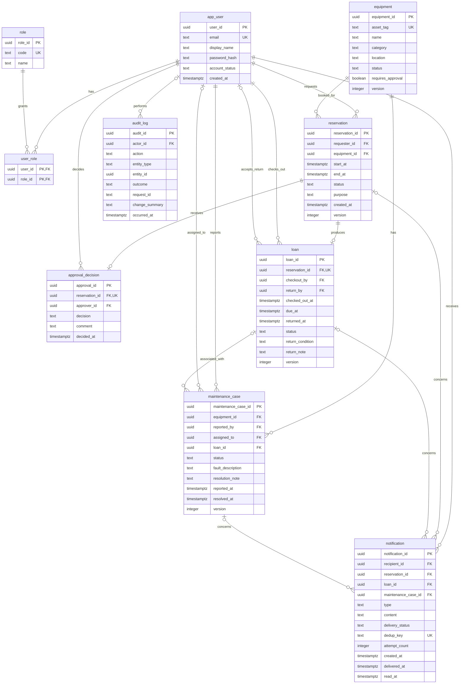
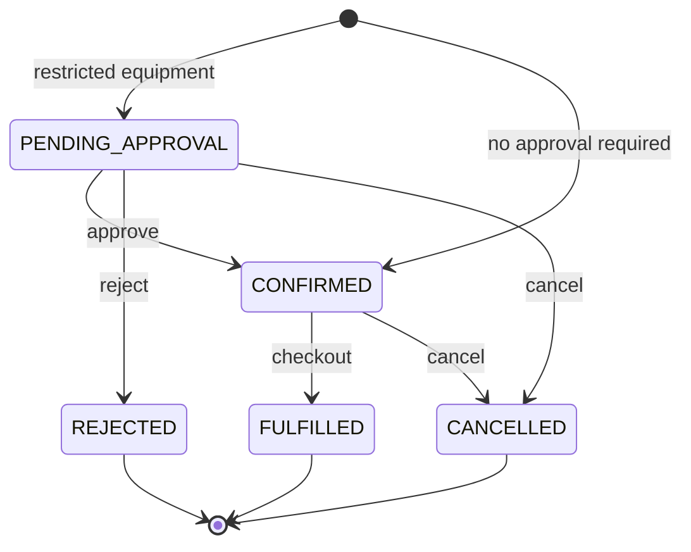
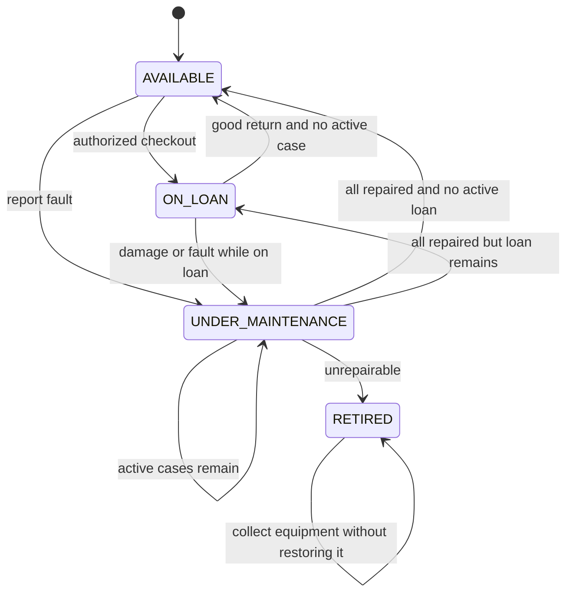
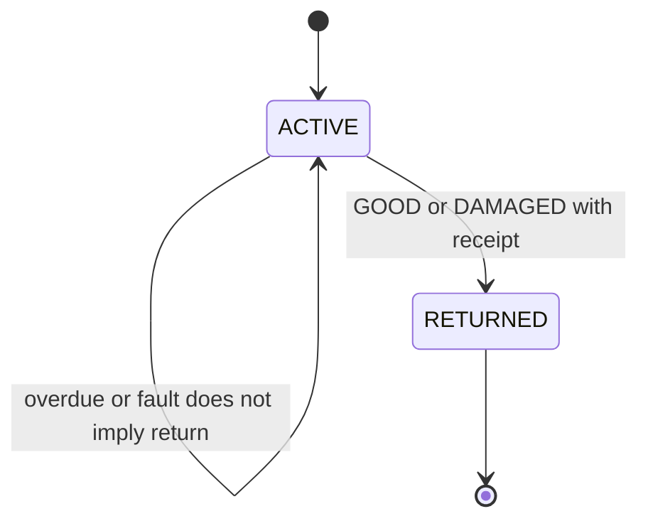
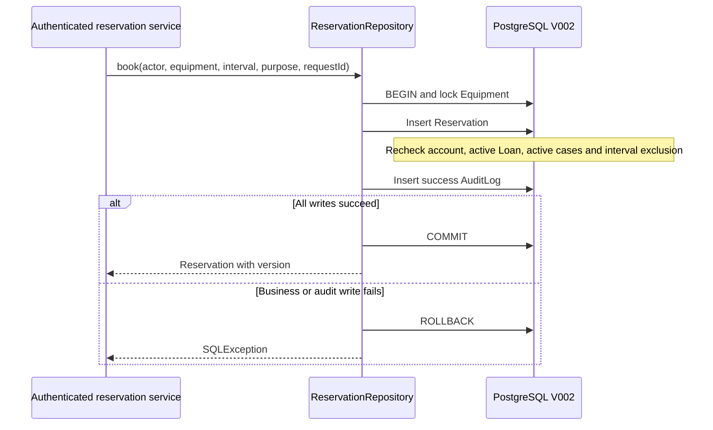

# SERMS Database and Domain Model

This page's ERD describes the V002 foundation. Wang Yuanmeng's notification interface is supported through optional V003; see the [interface alignment record](notification-interface-alignment.md) for current notification tables and identity mappings.

Owner: Zhou Fanhao. Current database version: V002, revised on 2026-09-25 using the ER diagram, analysis class diagram, checkout/return sequence diagrams, state descriptions and system integration notes in the SERMS directory. Their entities and business rules replace V001's provisional single-role model, simplified states and blanket prohibition on booking equipment already on loan.

## Reference Sources and Conflict Resolution

Primary sources:

- `SERMS_Domain_Glossary_and_ERD.md`: ten domain entities, fields, nullability, primary/foreign keys and relationship cardinalities.
- `Diagrams/ER Diagram.png`: entity, field and relationship verification.
- `Diagrams/Class Diagram.png`, `Pickup Sequence Diagram.png`, `Return Sequence Diagram.png`: Borrower/Custodian distinction, actual checkout/return records, audits and damaged-return relationships.
- `SERMS_Equipment_and_Loan_States.md` and equipment/loan state diagrams: official state codes, maintenance precedence and irreversible terminal states.
- `SERMS_System_Integration.md`: reservation slot occupancy, lock ordering, transaction boundaries and notification deduplication.
- `English_Deliverables/Domain_Glossary_EN.md` and `State_Pattern_Candidate_Final.md`: English terminology and pattern responsibility boundaries.

The Chinese glossary uses OR in its overlap formula, conflicting with the integration notes, English version and requirement to allow adjacent bookings. This implementation uses the consistent AND formula: `existing.start_at < requested.end_at AND requested.start_at < existing.end_at`.

`attempt.md` contains only the discussion topics "renewal requests" and "self-approval", without workflows or acceptance criteria. The detailed state and integration documents remain authoritative: no renewal and no self-approval. Discussion headings are not treated as confirmed rules.

## Terminology and Physical Mapping

| Domain Concept | Database Representation | Meaning |
| --- | --- | --- |
| User | app_user | Identity principal; no separate Student/Customer/Borrower tables |
| Role / UserRole | role / user_role | BORROWER, APPROVER, CUSTODIAN, MAINTAINER, ADMIN; users may have multiple roles |
| Equipment | equipment | One record per physical item; unique asset tag |
| Reservation | reservation | Requester requester_id, purpose and [start_at,end_at) interval |
| ApprovalDecision | approval_decision | One immutable final decision; at most one per reservation |
| Loan | loan | At most one loan per reservation; borrower and equipment are traced through Reservation |
| Custodian | loan.checkout_by / return_by | Checkout/return operator, distinct from the reservation requester |
| MaintenanceCase | maintenance_case | May be reported independently or linked to a Loan for the same equipment |
| Notification | notification | Recipient, exactly one business reference, deduplication key and delivery/retry/read information |
| AuditLog | audit_log | Append-only evidence of business operations; actor_id may be null for system jobs |
| Overdue | Time comparison | ACTIVE with now > due_at; RETURNED with returned_at > due_at records a late return; no stored OVERDUE state |

The physical name `app_user` avoids the SQL USER name conflict. Other fields follow the ER diagram, including user_id/equipment_id/reservation_id/requester_id/start_at/end_at. The original diagram does not enumerate account states; ACTIVE and DISABLED map from old active=true/false values. Existing implementation fields equipment.created_at and schema_version are retained without changing business relationships.

## Current ERD

The diagram below maps the original ERD to physical names. V002 creates all ten business entities rather than merely reserving their design. schema_version and equipment.created_at were not expanded in the original diagram.

## Implemented Data Constraints

| Object | V002 Constraints |
| --- | --- |
| app_user / role / user_role | Normalized unique email; allowed role codes; composite primary key prevents duplicate grants; foreign keys preserve history |
| equipment | Official allowed states; RETIRED cannot be restored; version increments on every update |
| reservation | Finite positive intervals; purpose; version; exclusion of overlapping occupying intervals; references and times cannot be rewritten arbitrarily; valid state transitions |
| approval_decision | One per reservation; rejection reason required; requester cannot approve their own reservation; decisions cannot be overwritten or deleted |
| loan | One per reservation; operator foreign keys; due_at equals the reservation end; at most one ACTIVE loan per equipment, checked after locking equipment; complete return fields and valid times; damage note required; returned results immutable |
| maintenance_case | Starts OPEN with valid transitions; assignment/in-progress requires assigned_to; closure requires outcome and end time; linked Loan must belong to the same equipment; an initially independent case may be linked once, but an existing loan link cannot be replaced |
| notification | Exactly one of three business references; unique dedup_key; nonnegative retry count; delivered_at/read_at require SENT and valid chronological order |
| audit_log | Actor may be null; other key identifiers required; UPDATE/DELETE/TRUNCATE prohibited; services validate polymorphic business-object references |

All ordinary foreign keys use RESTRICT to prevent cascading deletion of history. Triggers increment versions; applications must use `UPDATE ... WHERE id_column=? AND version=?` and check affected-row counts for optimistic concurrency control. A version field alone does not detect stale client writes.

## Reservation Availability

`PENDING_APPROVAL`, `CONFIRMED` and `FULFILLED` occupy their original reservation intervals; `CANCELLED` and `REJECTED` release them. Early return does not shorten the original reservation. Half-open intervals allow one reservation to end exactly when another starts.

UNDER_MAINTENANCE and RETIRED reject new bookings. AVAILABLE requires no active loan or maintenance case. ON_LOAN requires a non-overdue ACTIVE Loan, a requested start at or after its due_at, and no active maintenance case. Active cases block new bookings even if the equipment state has not yet synchronized. Reads and writes share `serms.equipment_can_reserve`; writes lock equipment and recheck.

Current intervals that have not ended are allowed; end_at must be later than submission time. The future checkout service must still verify `start_at <= now < end_at` before physical handover. Time uses Instant / timestamptz with at most microsecond precision; pages handle display time zones.

## States and Transactions

Equipment state precedence is RETIRED > active maintenance cases > ACTIVE Loan > AVAILABLE. Reporting a fault or retiring equipment on loan does not automatically end the Loan; receipt can still be recorded. Late return and damage can coexist and are both preserved. Maintenance follows OPEN -> ASSIGNED -> IN_PROGRESS -> RESOLVED/UNREPAIRABLE, without reopening terminal states.

Reservation creation and cancellation already commit atomically with success audits through the repository. Other cross-entity services remain for the next stage: approval decisions and reservation changes; checkout coordination across Loan, equipment and reservation; returns, maintenance cases and equipment state recomputation; notification scans and retries. Database constraints do not replace authentication, role authorization, on-site identity checks, checkout windows or end-to-end auditing.

Modules lock Equipment first, then Reservation, Loan and MaintenanceCase, ordering multiple records by ID. Database triggers acquire defensive equipment locks, but services must follow this order from the start of the transaction to avoid deadlocks caused by updating child records before acquiring the equipment lock. Retry the whole transaction a bounded number of times for 40P01/40001.

## Mapping to the Original Analysis Model

LoanDesk is a UI boundary and LoanControl an analysis control object that may become Controller/Service classes during design; neither is a database entity. User.roles maps to user_role, Reservation.requester to requester_id, and Loan custodians are persisted separately. LoanControl coordinates transactions involving MaintenanceCase and AuditLog; entities must not commit database transactions independently.

State Pattern remains a candidate. Under `State_Pattern_Candidate_Final.md`, adopting it would delegate allowed operations to equipment state classes while centralizing shared fact checks and target-state precedence in common rules. The implementation currently stores enum state codes and neither implements nor claims a State class hierarchy. Loan needs only ACTIVE/RETURNED, with no additional OverdueState.

## Migration and Handover

V001 remains unchanged. V002 atomically renames fields, migrates legacy roles and states, creates new tables and records version 2. Legacy TECHNICIAN becomes MAINTAINER without additional privileges. If old FULFILLED records overlap other occupying reservations, the new constraint rejects the entire migration for manual review; it neither deletes conflicts nor invents historical Loans.

V002 and the Java API require a coordinated upgrade: stop writes, back up, migrate and release the new module before reopening service. See the [database README](../database/README.md) for initialization/upgrade commands. Real tests cover data upgrades and database rules; they do not imply that complete approval, checkout, return, maintenance or notification services are implemented or deployed.
