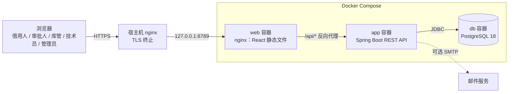
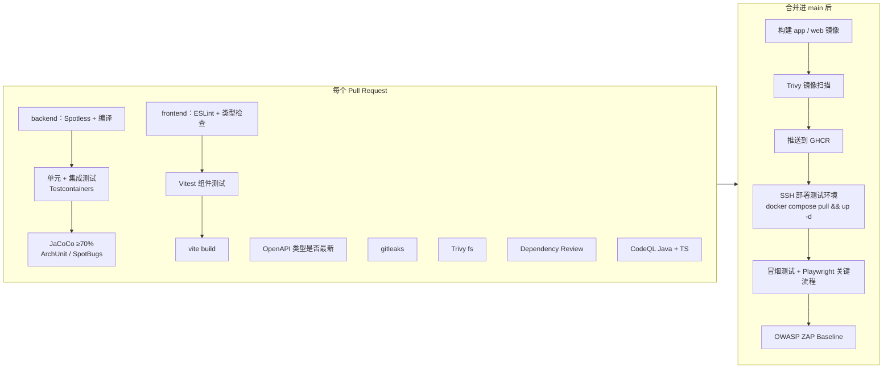

# SERMS 技术栈说明

Team 07 · Shared Equipment Reservation and Maintenance System（共享设备预约与维护系统）

本文件是全组统一的技术选型基准。依据是 Project Proposal（功能需求第 5 章、业务规则第 6 章、非功能需求第 7 章、DevSecOps 第 8.3 节）和《项目规划》中的 Definition of Done。每一项选型都能在第 3 节找到对应的需求；和 Proposal 不一致的地方集中写在第 4 节，并说明理由。

---

## 1. 全部技术栈

整体是**前后端分离**：前端是 React 单页应用，后端 Spring Boot 只提供 REST API，数据存在 PostgreSQL 18。

“状态” 一列说明这项技术目前是否已经写进代码：✅ 已在 main 上；🔶 只在个人分支上，尚未合并；⬜ 已定下，尚未落地。

### 1.1 前端（`frontend/`）

| 方面 | 技术 | 版本 | 状态 |
| --- | --- | --- | --- |
| 语言 | TypeScript（`strict` 模式） | 5.x | ⬜ |
| 框架 | React | 19 | ⬜ |
| 构建 / 开发服务器 | Vite | 7 | ⬜ |
| 路由 | React Router | 7 | ⬜ |
| 请求后端数据与缓存 | TanStack Query | 5 | ⬜ |
| 调用后端接口 | openapi-typescript + openapi-fetch（根据后端接口文档自动生成类型） | — | ⬜ |
| 表单与校验 | React Hook Form + Zod | — | ⬜ |
| UI 组件 / 样式 | shadcn/ui（基于 Radix，自带无障碍支持）+ Tailwind CSS | Tailwind 4 | ⬜ |
| 表格 | TanStack Table | 8 | ⬜ |
| 图表 | Recharts | 3 | ⬜ |
| 日期时间 | date-fns + date-fns-tz（按新加坡时间显示） | — | ⬜ |
| 包管理 / 运行时 | pnpm · Node.js LTS | Node 24 | ⬜ |
| 代码规范 | ESLint + Prettier | — | ⬜ |
| 单元 / 组件测试 | Vitest + React Testing Library + MSW（模拟接口） | — | ⬜ |
| 端到端测试 | Playwright | — | ⬜ |

### 1.2 后端（`app/`）

| 方面 | 技术 | 版本 | 状态 |
| --- | --- | --- | --- |
| 语言 | Java | 17 | ✅ |
| 框架 | Spring Boot（按业务模块划分的单体应用） | 3.5.x | ✅ |
| Web 接口 | Spring MVC，`/api/v1` 下的 JSON 接口 + Jakarta Bean Validation | 随 Boot | 🔶 目前 main 上是 Thymeleaf 页面，待改为 REST |
| 接口文档 | springdoc-openapi（OpenAPI 3） | 2.x | ⬜ |
| 错误格式 | RFC 9457 Problem Details（Spring 自带 `ProblemDetail`） | 随 Boot | ⬜ |
| 安全 | Spring Security：Session Cookie 登录、BCrypt 密码哈希、`@PreAuthorize` 方法级权限、CSRF（Cookie + 请求头） | 随 Boot | 🔶 main 上已有 Spring Security，待改为 JSON 登录 + RBAC |
| 数据访问 | Spring Data JPA / Hibernate；需要加锁或复杂查询的地方用 JdbcTemplate 手写 SQL | 随 Boot | ✅ |
| 定时任务 | Spring `@Scheduled` | 随 Boot | ✅ |
| 运维端点 | Spring Boot Actuator（只开放 `health`、`info`） | 随 Boot | ⬜ |
| 构建 | Maven（Maven Wrapper `./mvnw`） | 3.9 | ✅ |
| 测试 | JUnit 5 · Mockito · AssertJ · Spring Boot Test | 随 Boot | ✅ |
| 集成测试数据库 | Testcontainers（真实 PostgreSQL 18） | — | ⬜ |
| 分层规则检查 | ArchUnit | — | ⬜ |
| 覆盖率 | JaCoCo（service + domain ≥ 70% 作为合并门槛） | 0.8.x | ✅ 已生成报告，门槛待加 |
| 代码规范 / 静态分析 | Spotless（google-java-format）· SpotBugs + FindSecBugs | — | ⬜ |

### 1.3 数据库

| 方面 | 技术 | 版本 | 状态 |
| --- | --- | --- | --- |
| 数据库 | PostgreSQL（本地、CI、服务器统一用 `postgres:18-alpine`） | 18 | 🔶 周凡浩分支，配置里写的还是 17，待改为 18 |
| 表结构迁移 | Flyway（唯一的建表方式） | 随 Boot | ✅ |
| 预约防重叠 | PostgreSQL 排他约束（`EXCLUDE USING gist` + `tstzrange`） | — | 🔶 周凡浩分支 |
| 备份 | `pg_dump` 每日备份，保留 7 天 | — | ⬜ |

### 1.4 DevSecOps 与部署

| 方面 | 技术 | 状态 |
| --- | --- | --- |
| CI/CD | GitHub Actions | ✅ |
| 密钥扫描 | gitleaks | ✅ |
| 漏洞扫描 | Trivy（文件系统 + Docker 镜像） | ✅ 文件系统扫描；镜像扫描待加 |
| 依赖检查 | Dependency Review（PR 阶段）+ Dependabot（每周自动升级） | ✅ Dependency Review；Dependabot 待开 |
| 代码安全扫描 | CodeQL（Java + TypeScript） | ⬜ |
| 部署后安全扫描 | OWASP ZAP Baseline | ⬜ |
| 压力测试 | k6（50 并发） | ⬜ |
| 容器 | Docker（多阶段构建，非 root 运行）+ Docker Compose：`web` + `app` + `db` 三个容器 | 🔶 目前只有 welcome 静态页一个容器 |
| 镜像仓库 | GitHub Container Registry（GHCR） | ⬜ |
| 服务器 | 香港服务器 + nginx + Let's Encrypt，https://serms.midas.cyou | ✅ |

### 1.5 可选功能（时间允许再做）

| 功能 | 技术 |
| --- | --- |
| 邮件通知 | Spring Mail；开发时用 Mailpit 接收测试邮件 |
| 二维码 | 前端用 `qrcode` 生成，`@zxing/browser` 扫码 |

### 1.6 协作

| 方面 | 技术 |
| --- | --- |
| 代码托管 | Git + GitHub |
| 项目管理 | GitHub Projects（看板：To Do → In Progress → Review → Testing → Done） |
| 设计图 | PlantUML / Mermaid（源文件放在 `docs/diagrams/`），draw.io 作为补充 |

---

## 2. 架构

### 2.1 系统上下文与部署



- **同源部署**：浏览器看到的前端页面和 `/api` 都在 `https://serms.midas.cyou` 同一个域名下，由 web 容器的 nginx 把 `/api/*` 转发给后端。这样不需要处理跨域（CORS），登录也可以直接用安全的 HttpOnly Session Cookie，不需要把 JWT 存在浏览器里。
- 数据库容器不对外暴露端口，只有 app 容器能访问。
- Proposal 明确排除了微服务和 Kubernetes，所以后端只有一个进程。

### 2.2 后端代码结构（按业务模块划分的单体）

根包为 `sg.edu.nus.serms`。一级子包按**业务领域**划分，对应 Proposal 7.5 节要求的 “users, equipment, reservations, borrowing, maintenance, notifications”：

```
sg.edu.nus.serms
├── identity       用户、角色、登录、账号启停（5.1）
├── equipment      设备类别、设备档案、搜索与可用性（5.2、5.3 搜索部分）
├── reservation    预约提交 / 取消、冲突检测、借用规则（5.3）
├── approval       审批与拒绝、审批意见（5.4）
├── loan           领用、归还、逾期检测（5.5）
├── maintenance    故障报告、维修工单、维修历史（5.6）
├── notification   应用内通知、提醒、可选邮件（5.7）
├── report         统计报表（5.7）
├── audit          审计记录（5.7、业务规则 9）
└── shared         安全配置、全局异常处理、时间工具
```

每个业务模块内部固定分四层：

| 层 | 职责 | 不允许做的事 |
| --- | --- | --- |
| `api` | REST Controller、请求 / 响应 DTO；从登录信息取当前用户 | 写业务规则、直接访问 repository、把 JPA 实体直接返回给前端 |
| `service` | 事务边界、用例编排、权限检查（`@PreAuthorize`） | 处理 HTTP 细节 |
| `domain` | 实体、状态机、策略类等业务规则 | 依赖 Spring MVC |
| `repository` | JPA Repository 或 JdbcTemplate 查询 | 写业务判断 |

以上规则由 **ArchUnit 测试**自动检查，比如：controller 不能直接访问 repository；一个模块不能访问其他模块的 `repository`，跨模块只能调用对方 `service` 的公开方法，或者通过事件通信。

### 2.3 前端代码结构

```
frontend/src
├── app/            路由表、全局 Provider（QueryClient、登录状态）、页面布局
├── api/            由 OpenAPI 生成的类型 + 统一的请求封装（自动带 CSRF 头、处理 401 跳转登录）
├── components/     通用组件（shadcn/ui 组件、表格、空状态、错误提示）
├── features/       按业务模块划分，和后端一一对应
│   ├── auth/  equipment/  reservation/  approval/  loan/
│   └── maintenance/  notification/  report/  admin/
└── lib/            工具函数（日期格式化、权限判断）
```

- 每个 `features/<模块>/` 下放这个模块的页面、组件、`useXxx` 数据钩子，以及对应的测试文件（`*.test.tsx`）。
- **页面按角色显示菜单和按钮，只是为了体验；真正的权限检查一律在后端做。**
- 页面一致性（Proposal 7.4）：统一使用 `components/` 里的布局、表单、表格、状态标签组件；设备和预约状态的中文名称、颜色在一个地方集中定义。

### 2.4 前后端接口约定

- 所有接口在 `/api/v1/...` 下，使用 JSON。
- 后端用 springdoc-openapi 自动生成接口文档（`/api/v1/openapi.json`，开发环境开放 Swagger UI）。
- 前端用 `openapi-typescript` 根据这份文档生成 TypeScript 类型。**接口一改，前端类型跟着重新生成，字段对不上会直接编译失败**，不会等到运行时才发现。CI 会检查生成的类型是否是最新的。
- 出错时统一返回 Problem Details 格式（`type`、`title`、`status`、`detail`，校验失败时附带字段错误列表），前端统一展示。
- 列表接口统一分页参数：`page`、`size`、`sort`。

### 2.5 模块之间如何通信

- **同步调用**：需要立即拿到结果时，直接调用对方模块的 service。
- **领域事件**（观察者模式，用 Spring `ApplicationEventPublisher` 实现）：业务动作发生后，发布 `ReservationSubmitted`、`ReservationDecided`、`EquipmentIssued`、`EquipmentReturned`、`LoanOverdue`、`MaintenanceAssigned`、`MaintenanceCompleted` 等事件，由 `notification` 和 `audit` 模块订阅。
  - 审计记录和通知请求都在发起方的同一个事务里写库：业务回滚，它们也一起回滚。
  - 真正的通知投递由定时任务在事务提交后完成，带重试次数上限。
- 前端的通知小红点用 TanStack Query 定时刷新未读数量（例如每 30 秒一次）。不引入 WebSocket，Proposal 已排除实时聊天。

---

## 3. 需求覆盖：每一项需求由什么技术实现

### 3.1 功能需求

| 需求（Proposal 章节） | 实现方式 |
| --- | --- |
| 登录 / 登出（5.1） | 前端登录页提交 `POST /api/v1/auth/login`；后端 Spring Security 建立 Session，Cookie 设为 `HttpOnly`、`Secure`、`SameSite=Lax`；`GET /api/v1/auth/me` 返回当前用户和角色 |
| 五种角色，一个用户可有多个角色（3、5.1） | `app_user` ↔ `role` 多对多表，映射为 Spring Security 的 `ROLE_*` 权限 |
| 按角色显示功能（5.1） | 前端根据 `/auth/me` 返回的角色显示菜单和按钮；**后端 service 层用 `@PreAuthorize` 做真正的权限检查** |
| 管理员管理账号和角色（5.1） | 前端 `features/admin` 页面 + 后端 `identity` 模块接口；角色变更时写审计记录 |
| 设备档案、编号和序列号唯一（5.2） | 数据库 `UNIQUE` 约束；前端 Zod 做即时校验，后端 Bean Validation 再校验一次；重复编号返回 409，前端显示在对应字段下 |
| 设备状态、报废设备保留历史（5.2） | 状态用枚举，加数据库 `CHECK` 约束；状态转换用状态模式集中实现。**状态个数待确认**：Proposal 5.2 列出五种（含 Reserved），当前数据模型为四种（`AVAILABLE`、`ON_LOAN`、`UNDER_MAINTENANCE`、`RETIRED`），见 [接口合同第 9 节](contracts/auth-and-approval.md#9-待确认事项) |
| 按名称 / 类别 / 位置 / 时间段搜索（5.3） | 后端 JPA Specification 动态拼查询条件，“时间段可用” 用 SQL 区间重叠判断；前端搜索条件同步到 URL 参数，刷新和分享链接都能保留 |
| **不允许重叠预约**（5.3、规则 1、规则 12） | PostgreSQL **排他约束**：`EXCLUDE USING gist (equipment_id WITH =, tstzrange(start_at, end_at) WITH &&)`，只对 “待审批 / 已确认 / 已领用” 状态生效。“检查可用性 + 插入预约” 放在同一个事务里；并发下哪怕应用层检查被绕过，数据库也会拒绝。后端把这个错误转换成 409 “该时段已被预约”，前端提示用户换一个时段 |
| 预约校验：时长上限、资格、配额、是否需审批（5.3、规则 10、11） | **策略模式**：`ReservationPolicy` 接口，每条规则一个策略类，按设备类别或借用人类型组合使用 |
| 取消预约（已领用后不可取消）（5.3、规则 4） | 预约状态机 + 带状态条件的 `UPDATE ... WHERE status IN (...)` |
| 审批 / 拒绝并填写意见（5.4） | `approval_decision` 表，每个预约最多一条且写入后不可修改；不允许审批自己的预约；审批步骤用**责任链模式**。接口与状态码见 [docs/contracts/auth-and-approval.md](contracts/auth-and-approval.md) |
| 领用前校验、记录领用时间和库管（5.5） | `loan` 模块 service 在一个事务里：按固定顺序加行锁（设备 → 预约）→ 校验 → 写 `loan` 记录 → 改设备状态；前端库管页面支持按预约号、借用人或设备编号查找 |
| 归还、登记设备状况、损坏转入维修（5.5、规则 7） | 归还时发布 `EquipmentReturned` 事件；登记为损坏时在同一个事务里创建维修工单，设备转为 “维修中” |
| 逾期识别与提醒（5.5） | `@Scheduled` 定时扫描；每条提醒按 “借用记录 + 提醒类型 + 应还时间” 生成**去重键**，数据库唯一约束保证同一条提醒只生成一次 |
| 查看逾期设备和逾期时长（5.5） | 后端一条查询直接计算 `now() - due_at`；前端用 TanStack Table 按逾期时长排序 |
| 故障报告、维修流程（5.6） | `maintenance_case` 状态机（**状态模式**）。**状态个数待确认**：Proposal 5.6 列出六种（含 Closed），当前数据模型为五种，见 [接口合同第 9 节](contracts/auth-and-approval.md#9-待确认事项)；有未关闭工单的设备，可用性判断直接返回 “不可预约”（规则 2、8） |
| 维修历史（5.6） | 工单和状态变更记录只追加、不删除；前端在设备详情页按时间线展示 |
| 应用内通知（5.7） | `notification` 表 + 收件箱页面 + 导航栏未读数量；通知渠道抽象为 `NotificationChannel` 接口（**适配器 / 工厂方法模式**），第一版只实现站内通知 |
| 邮件通知（可选） | 再实现一个 `NotificationChannel`，用 Spring Mail 发送；开发环境用 Mailpit 接收 |
| 报表（5.7） | 后端 `report` 模块用只读 SQL 聚合查询；前端用 Recharts 画图 + TanStack Table 显示明细，可导出 CSV |
| 审计记录（5.7、规则 9） | `audit_log` 表只允许追加（数据库触发器拒绝 `UPDATE` 和 `DELETE`），由领域事件监听器统一写入：操作人、动作、对象、时间 |
| 二维码（可选） | 前端为设备编号生成二维码；库管页面可用摄像头扫码，也保留手工输入编号 |

### 3.2 非功能需求

| 需求（Proposal 7） | 实现方式 |
| --- | --- |
| 密码安全哈希 | Spring Security `DelegatingPasswordEncoder`，默认 BCrypt，可无缝升级到 Argon2 |
| 服务端权限检查 | `@EnableMethodSecurity` + service 方法上的 `@PreAuthorize`；URL 层再做一道粗粒度拦截；前端隐藏按钮不算权限控制 |
| 输入校验 | 前端 Zod（即时提示）+ 后端 Bean Validation（最终把关）+ 数据库约束兜底 |
| CSRF 防护 | Spring Security `CookieCsrfTokenRepository`：后端下发 `XSRF-TOKEN` Cookie，前端请求封装自动在修改类请求上带 `X-XSRF-TOKEN` 请求头 |
| XSS 防护 | React 默认转义输出，禁止使用 `dangerouslySetInnerHTML`（ESLint 规则拦截）；nginx 下发 CSP 响应头 |
| 机密不进代码 | 环境变量注入；服务器放在 `/opt/agfp/.env`，CI 放在 GitHub Secrets；前端构建产物中不放任何密钥；gitleaks 扫描整个 git 历史 |
| 日志里不出现凭据 | 后端不打印请求体；Actuator 只暴露 `health` 和 `info` |
| HTTPS | 宿主机 nginx + Let's Encrypt 自动续期（已配置好） |
| 2 秒内响应、50 并发用户 | 常用查询字段加索引，列表分页；HikariCP 连接池；前端静态文件由 nginx 直接提供并长期缓存；Sprint 3 用 k6 做一次 50 并发压测，结果留作证据 |
| 报表 5 秒内完成 | 聚合查询加索引；数据量大时改用物化视图 |
| 相关更新放在同一事务 / 失败不留脏数据 | service 层 `@Transactional`；JPA `@Version` 乐观锁防止覆盖别人的修改（冲突时返回 409，前端提示刷新）；领用 / 归还按固定顺序加锁避免死锁 |
| 错误提示不暴露内部信息 | 后端全局异常处理，统一返回 Problem Details，不带堆栈；前端统一的错误提示组件 |
| 备份与恢复 | `scripts/backup.sh`：每天用 `pg_dump` 导出并保留 7 天；`docs/runbook-backup.md` 写明恢复步骤，并至少演练一次 |
| 页面一致、支持桌面和平板 | shadcn/ui + Tailwind 响应式布局；统一的布局、表单、表格、状态标签组件 |
| 统一编码规范 | 后端 Spotless，前端 ESLint + Prettier，都在 CI 中检查，不合规范的代码无法合并 |
| 界面 / 业务 / 数据分层 | 前后端物理分离；后端按第 2.2 节分层，由 ArchUnit 强制执行 |
| 业务规则有单元测试 | 策略类、状态机、领域服务用 JUnit 5 + Mockito 测试 |
| 安全、持久化、流程有集成测试 | Spring Boot Test + Testcontainers（PostgreSQL 18），重点测并发预约、领用和归还的竞争、权限拦截 |
| service / domain 覆盖率 ≥ 70% | JaCoCo `check` 规则只统计 `**.service.**` 和 `**.domain.**`，低于 70% 时构建失败 |
| 时间一致 | 数据库统一 `timestamptz`，Java 统一 `Instant`，接口传 ISO-8601 UTC 字符串，前端按 `Asia/Singapore` 时区显示 |

### 3.3 DevSecOps 流水线（Proposal 8.3 + DoD 第 7、8 条）



| Proposal 要求的环节 | 对应的工具 / 任务 |
| --- | --- |
| Source code checkout | `actions/checkout` |
| Application compilation | 后端 `./mvnw verify`；前端 `pnpm typecheck && pnpm build` |
| Unit and integration testing | 后端 JUnit 5、Mockito、Spring Boot Test、Testcontainers；前端 Vitest + React Testing Library + MSW |
| Test coverage generation | JaCoCo（后端）+ Vitest coverage（前端），报告作为 CI 产物上传 |
| Static code analysis | SpotBugs + FindSecBugs、CodeQL（Java + TypeScript）、Spotless、ESLint、ArchUnit |
| Dependency vulnerability checking | Dependency Review（PR 阶段，Maven + npm）+ Dependabot（每周自动提升级 PR）+ Trivy fs |
| Application packaging | Spring Boot 可执行 jar；前端静态文件 |
| Docker image creation | 两个多阶段镜像：`app`（`eclipse-temurin:17-jre`）、`web`（`nginx-unprivileged`），都以非 root 运行 |
| Container vulnerability checking | Trivy image，发现 HIGH / CRITICAL 级漏洞时失败 |
| Deployment to a test environment | GitHub Actions 通过 SSH 执行 `docker compose pull && up -d`；Flyway 在后端启动时自动迁移数据库 |
| Basic post-deployment verification | 冒烟测试（`/api/v1/health` 返回 UP、首页返回 200）+ Playwright 跑登录和一次预约 + ZAP Baseline |

**必须通过的检查**（在 main 分支保护里设为 required checks）：`backend`、`frontend`、`Secrets scan (gitleaks)`、`Vulnerability scan (Trivy)`、`Dependency review`、`CodeQL`。

### 3.4 环境

| 环境 | 用途 | 数据库 | 启动方式 |
| --- | --- | --- | --- |
| 本地开发 | 写代码、调试 | `compose.dev.yaml` 起一个 PostgreSQL 18 | 后端 `./mvnw spring-boot:run`；前端 `pnpm dev`（Vite 把 `/api` 代理到后端，和线上一样同源） |
| CI | 自动化测试 | Testcontainers 临时起的 PostgreSQL 18 | GitHub Actions |
| 测试 / 演示环境 | Sprint Review、验收、Demo | Compose 里的 PostgreSQL 18，数据保存在持久卷 | 合并进 main 后自动部署 |

本地、CI、服务器三处的 PostgreSQL 必须是同一个大版本（18），镜像统一写 `postgres:18-alpine`。

### 3.5 设计模式与技术的对应（Proposal 9.3）

| 模式 | 用在哪里 | 技术落点 |
| --- | --- | --- |
| Strategy | 借用时长、配额、资格、是否需审批 | `ReservationPolicy` 的多个 Spring Bean，按类别组合 |
| Chain of Responsibility | 审批步骤 | `ApprovalHandler` 链，由 Spring 按 `@Order` 顺序注入 |
| State | 设备、预约、维修工单的状态转换 | 各领域对象的状态类 + 数据库 `CHECK` 约束兜底 |
| Observer | 业务事件 → 通知、审计 | Spring 领域事件 + 同步事务监听器 |
| Adapter / Factory Method | 通知渠道（站内、邮件） | `NotificationChannel` 接口 + 按配置启用的具体实现 |

---

## 4. 与 Proposal 的差异及理由

| Proposal 写的 | 现在的选择 | 理由 |
| --- | --- | --- |
| Thymeleaf、HTML、CSS、Bootstrap、JavaScript（服务端渲染页面） | **React 19 + TypeScript + Vite 单页应用**，shadcn/ui + Tailwind；后端只提供 REST API | 预约日历、按时间段搜索、审批列表、报表图表这类交互多的页面，用组件化前端更容易做好体验，也更容易测试（组件测试 + 端到端测试）；前后端通过 OpenAPI 生成的类型对接，接口变了编译期就能发现；前后端分开开发，五个人并行时冲突更少。Proposal 7.5 要求的 “界面 / 业务 / 数据分离” 在前后端分离后更彻底 |
| MySQL | **PostgreSQL 18** | 核心规则 “不允许重叠预约”（规则 1、12）可以用 PostgreSQL 的区间类型 + 排他约束在数据库层直接保证，并发下也不会出错；MySQL 没有这个功能，只能在应用层加锁。`timestamptz`、`CHECK` 约束、部分索引也更适合存状态和时间 |
| H2 作测试库 | **Testcontainers + 真实 PostgreSQL 18** | H2 模拟不了排他约束、行锁和并发行为，测试通过不代表线上正确 |
| SpotBugs **或** PMD | SpotBugs + FindSecBugs，外加 CodeQL | FindSecBugs 专查安全问题，CodeQL 同时覆盖 Java 和 TypeScript；代码风格交给 Spotless / Prettier |
| OWASP Dependency-Check **或** Dependabot | Dependabot + Dependency Review + Trivy | 同时覆盖 Maven 和 npm 依赖，GitHub 原生、零配置，在 PR 阶段就能拦截 |
| 部署平台待定 | 香港服务器（已配好域名和 HTTPS）+ GHCR 镜像 | 已可使用，不依赖学生额度；镜像在 CI 中构建并扫描后再部署 |
| Jira 或 GitHub Projects | GitHub Projects | 和 PR、Issue 在同一处，DoD 要求的证据可以直接互相链接 |
| — | **新增** ArchUnit、Testcontainers、Playwright、MSW、k6、OWASP ZAP、Actuator、springdoc-openapi | 把 7.5 节的分层要求、7.2 节的性能指标、8.3 节的部署后验证都变成自动检查，并留下证据 |

---

## 5. 测试台（Test Bench）：每人负责自己的

**CI 只能跑已经写好的测试，没有测试的功能，CI 也证明不了它是对的。** 所以每位成员必须为自己负责的用例写好完整的测试台，并随代码一起提交。这样每个 PR 在 CI 上都能自己验证自己，不用等别人手工测试，也不会在合并时把别人的功能弄坏而没人发现。

### 5.1 每个测试台必须满足的要求

1. **后端测试**放在 `app/src/test/java/sg/edu/nus/serms/<模块>/`；**前端测试**和组件放在一起：`frontend/src/features/<模块>/**/*.test.tsx`。
2. **后端三层都要有**：
   - **单元测试**：领域规则、策略类、状态机。不连数据库，毫秒级完成（JUnit 5 + Mockito）。
   - **集成测试**：service + repository + 真实 PostgreSQL 18（Spring Boot Test + Testcontainers），覆盖事务、约束和并发。
   - **API / 权限测试**：controller 的正常请求、校验失败（返回 400 和字段错误）、无权限访问（401 / 403）、缺少 CSRF 头（MockMvc + spring-security-test）。
3. **前端至少两层**：
   - **组件测试**：自己模块的页面和表单，包括校验提示、加载中、空状态、接口报错时的显示（Vitest + React Testing Library，接口用 MSW 模拟）。
   - **端到端测试**：自己用例的主流程至少一条 Playwright 脚本（例如 “登录 → 搜索 → 预约成功”）。
4. **覆盖用例的正常流程和所有主要异常流程**：按下表逐条写，每条异常流程至少对应一个测试方法。
5. **能自己跑起来**：本机装了 Docker 和 Node，执行 `./mvnw verify`（后端）和 `pnpm test`（前端）就能跑完。不需要手工建库、设置环境变量或运行额外脚本；CI 上执行的也是同样的命令。
6. **不依赖其他测试**：每个测试自己准备数据（用随机 UUID 或唯一编号），不依赖执行顺序，不清空别人会用到的表，不假设表里 “只有我的数据”。
7. **测的是行为而不是实现**：断言业务结果、数据库状态、HTTP 响应、页面上用户看得到的内容，不断言内部调用了哪个私有方法。
8. **和功能代码在同一个 PR 里提交**。新增行为没有对应测试的 PR 不得合并；后端覆盖率低于 70%（service + domain）时 CI 直接失败。

### 5.2 每位成员的测试台范围

| 成员 | 负责用例 | 测试台至少覆盖 |
| --- | --- | --- |
| Shi Wenqi | 搜索并预约设备 | 按条件搜索；指定时段可用性；预约成功；时间冲突（含两个请求并发抢同一时段，只能成功一个）；设备维修中 / 报废不可预约；超出时长或配额被规则拒绝；借用人取消预约；领用后不可取消。前端：搜索条件校验、冲突时的提示 |
| Zhang Hanming | 审核和批准预约 | 无需审批的设备直接确认；批准；拒绝并填写意见（拒绝后时段被释放）；不能审批自己的预约；非审批人被拒绝访问；审批记录写入后不可修改。前端：待审批列表、拒绝时必须填写意见 |
| Zhou Fanhao | 设备领用和归还 | 正常领用；非法领用（未批准、不在领用时间窗、设备不匹配）；正常归还；逾期归还；损坏归还后自动转入维修；同一设备并发领用只能成功一次。前端：按预约号 / 借用人 / 设备编号查找、归还时登记设备状况 |
| Liu Tongyao | 故障报告和维修处理 | 报告故障后设备立即不可预约；分配技术员；维修状态六步流转及非法流转被拒绝；修复后设备恢复可用；无法修复后设备报废；维修历史完整保留。前端：工单状态按钮只显示当前允许的操作 |
| Wang Yuanmeng | 逾期检测和通知 | 即将到期提醒；已经逾期提醒；通知投递成功；投递失败后重试，达到上限后标记失败；重复提醒只生成一次；设备已归还时取消未发送的提醒；收件人只能看到自己的通知。前端：收件箱、未读数量、标记已读 |

公共测试基础设施由 **Zhang Hanming**（测试策略负责人）维护：后端的 Testcontainers 基类、测试数据构造工具、ArchUnit 分层规则；前端的 MSW 公共 handler、带登录状态的渲染工具、Playwright 登录夹具。其他成员直接复用，不要各自再写一套。

### 5.3 CI 如何使用这些测试台

- 每个 PR 自动运行后端 `./mvnw verify` 和前端 `pnpm lint && pnpm typecheck && pnpm test && pnpm build`，全部模块的测试都会运行。
- 任何一个测试失败，PR 都不能合并。修改自己模块时如果把别人的测试跑挂了，说明破坏了别人的功能，要先修好再合并。
- 测试报告和覆盖率报告作为 CI 产物上传，直接作为 DoD 要求的 “测试证据”。
- 不允许为了让 CI 变绿而跳过、删除或注释掉测试（`@Disabled` / `it.skip` 必须在 PR 描述里说明原因，并由另一位成员同意）。

---

## 6. 团队约定

1. **后端只有一个应用**（`app/`），**前端只有一个应用**（`frontend/`）；不再为单个功能另建独立工程。
2. **只有一条 Flyway 迁移序列**：`app/src/main/resources/db/migration/V{三位编号}__{说明}.sql`。已合并的迁移不再修改，要改表就新增迁移；编号冲突时，后合并的 PR 负责重新编号。
3. `spring.jpa.hibernate.ddl-auto=validate`：Hibernate 只校验表结构，不自动建表或改表。
4. PostgreSQL 统一用 **18**：本地、CI、服务器的镜像都写 `postgres:18-alpine`。
5. 所有时间存 UTC，接口传 ISO-8601，只在前端转换成新加坡时间显示。
6. 需要 “检查后再写入” 的业务操作（预约、领用、归还），一律在 service 的一个事务里完成，并由数据库约束兜底。
7. 后端接口改动后，前端必须重新生成 API 类型并一起提交。
8. 新增依赖（Maven 或 npm）必须能通过 Dependency Review 和 Trivy；引用外部代码时，在 PR 描述里写明来源和许可证。

## 7. 已有代码如何对齐

- **main 上的 `app/`**（王远蒙，已合并）：通知的领域、服务和定时投递逻辑可以直接沿用。需要改动的地方：
  - Thymeleaf 页面（`templates/`）和返回页面的 controller，改成 `/api/v1/notifications` 下的 REST 接口；收件箱页面移到 `frontend/src/features/notification/`。
  - 数据库从 MySQL / H2 换成 PostgreSQL 18 / Testcontainers，删掉 `db/mysql` 迁移。
  - Spring Security 从表单登录页改成 JSON 登录接口 + `CookieCsrfTokenRepository`。
- **`feat/zhoufanhao-sprint1-data-foundation`**（周凡浩，未合并）：PostgreSQL 表结构和约束设计与本文件一致。需要改动的地方：
  - `database/compose.yaml`、`database.yml` 和测试脚本里的 `postgres:17-alpine` 改为 `postgres:18-alpine`，和他本地用的 18 保持一致。
  - SQL 迁移移进 `app` 的 Flyway 序列；包名 `edu.nus.serms` 改为 `sg.edu.nus.serms`；`ReservationRepository` 改为注入 Spring 的 `DataSource` / `JdbcTemplate`；`integration/notifications` 适配模块和补丁文件在合并后删除。
- **根目录部署文件**：`Dockerfile` 和 `compose.yaml` 从 “welcome 静态页” 换成 `web`（React + nginx）、`app`（Spring Boot）、`db`（PostgreSQL 18）三个服务。同时更新 `.env.example`：增加数据库账号密码，`HEALTH_PATH=/api/v1/health`。
