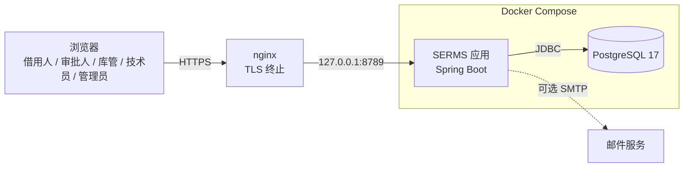
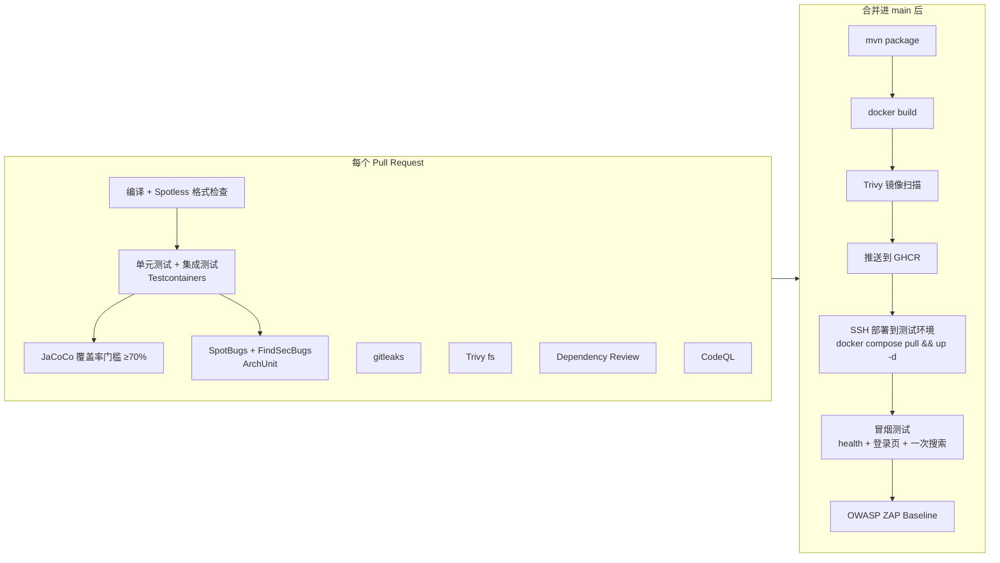

# SERMS 技术栈说明

Team 07 · Shared Equipment Reservation and Maintenance System（共享设备预约与维护系统）

本文件是全组统一的技术选型基准。依据是 Project Proposal（功能需求第 5 章、业务规则第 6 章、非功能需求第 7 章、DevSecOps 第 8.3 节）和《项目规划》中的 Definition of Done。每一项选型都能在第 3 节找到它对应的需求；和 Proposal 不一致的地方集中写在第 4 节，并说明理由。

---

## 1. 一页总览

| 层次 | 选型 | 版本基线 |
| --- | --- | --- |
| 语言 | Java | 17（编译目标；本机可用 17 及以上的任意 JDK） |
| 应用框架 | Spring Boot（单体应用，内部按业务模块划分） | 3.5.x |
| Web | Spring MVC + Jakarta Bean Validation | 随 Boot |
| 页面 | Thymeleaf + Bootstrap 5 + 少量原生 JavaScript；报表图表用 Chart.js | Bootstrap 5.3、Chart.js 4（通过 WebJars 引入） |
| 安全 | Spring Security（表单登录、BCrypt、方法级权限、CSRF） | 随 Boot |
| 持久化 | Spring Data JPA / Hibernate；需要加锁或复杂查询的地方用 JdbcTemplate 手写 SQL | 随 Boot |
| 数据库 | **PostgreSQL** | 17 |
| 表结构迁移 | Flyway（唯一的建表方式） | 随 Boot |
| 定时任务 | Spring `@Scheduled` | 随 Boot |
| 运维端点 | Spring Boot Actuator（只开放 `health`、`info`） | 随 Boot |
| 构建 | Maven（使用 Maven Wrapper `./mvnw`） | 3.9 |
| 单元测试 | JUnit 5 + Mockito + AssertJ | 随 Boot |
| 集成测试 | Spring Boot Test + **Testcontainers（真实 PostgreSQL）** | Testcontainers 1.20+ |
| 架构约束测试 | ArchUnit | 1.3+ |
| 端到端 / 验收测试 | Playwright for Java（少量关键流程） | 1.4x |
| 覆盖率 | JaCoCo（service + domain 包 ≥ 70% 作为合并门槛） | 0.8.x |
| 代码规范 | Spotless（google-java-format） | — |
| 静态分析 | SpotBugs + FindSecBugs 插件；GitHub CodeQL | — |
| 依赖漏洞 | Dependabot + GitHub Dependency Review | — |
| 密钥扫描 | gitleaks | — |
| 镜像 / 文件系统漏洞 | Trivy | — |
| 动态安全扫描（DAST） | OWASP ZAP Baseline（扫测试环境） | — |
| 容器 | Docker（多阶段构建，非 root 运行）+ Docker Compose | — |
| 镜像仓库 | GitHub Container Registry（GHCR） | — |
| CI/CD | GitHub Actions | — |
| 测试 / 演示环境 | 香港服务器 + nginx 反向代理 + Let's Encrypt，https://serms.midas.cyou | — |
| 可选：邮件通知 | Spring Mail；开发时用 Mailpit 接收测试邮件 | 时间允许时做 |
| 可选：二维码 | ZXing | 时间允许时做 |
| 项目管理 | GitHub Projects（看板：To Do → In Progress → Review → Testing → Done） | — |
| 设计图 | PlantUML / Mermaid 源文件放在仓库 `docs/diagrams/`，draw.io 作为补充 | — |

一句话概括：**一个 Spring Boot 应用 + 一个 PostgreSQL，整套用 Docker Compose 跑；GitHub Actions 负责从编译一直到冒烟测试的整条流水线。**

---

## 2. 架构

### 2.1 系统上下文



Proposal 明确排除了微服务和 Kubernetes，所以只有**一个应用进程加一个数据库**。数据库不向外暴露端口，只有应用容器能访问。

### 2.2 代码结构（按业务模块划分的单体）

根包为 `sg.edu.nus.serms`。一级子包按**业务领域**划分，对应 Proposal 7.5 节要求的 “users, equipment, reservations, borrowing, maintenance, notifications”：

```
sg.edu.nus.serms
├── identity       用户、角色、登录、账号启停（5.1）
├── equipment      设备类别、设备档案、搜索与可用性（5.2、5.3 搜索部分）
├── reservation    预约提交/取消、冲突检测、借用规则（5.3）
├── approval       审批与拒绝、审批意见（5.4）
├── loan           领用、归还、逾期检测（5.5）
├── maintenance    故障报告、维修工单、维修历史（5.6）
├── notification   应用内通知、提醒、可选邮件（5.7）
├── report         统计报表（5.7）
├── audit          审计记录（5.7、业务规则 9）
└── shared         安全配置、全局异常处理、页面公共片段、时间工具
```

每个业务模块内部固定分四层：

| 层 | 职责 | 不允许做的事 |
| --- | --- | --- |
| `web` | Controller、表单对象、选择视图；从登录信息取当前用户 | 写业务规则、直接访问 repository |
| `service` | 事务边界、用例编排、权限检查（`@PreAuthorize`） | 渲染页面 |
| `domain` | 实体、状态机、策略类等业务规则 | 依赖 Spring MVC |
| `repository` | JPA Repository 或 JdbcTemplate 查询 | 写业务判断 |

上述规则由 **ArchUnit 测试**自动检查，比如：controller 不能直接访问 repository；某个模块不能访问其他模块的 `repository`，跨模块只能调用对方 `service` 的公开方法，或者通过事件通信。这样 “业务规则不能写在 controller 和模板里”（7.5）就成了编译后自动检查的规则，而不只是口头约定。

### 2.3 模块之间如何通信

- **同步调用**：需要立即拿到结果时，直接调用对方模块的 service。比如预约模块向设备模块查询设备状态。
- **领域事件**（观察者模式，用 Spring `ApplicationEventPublisher` 实现）：业务动作发生后，发布 `ReservationSubmitted`、`ReservationDecided`、`EquipmentIssued`、`EquipmentReturned`、`LoanOverdue`、`MaintenanceAssigned`、`MaintenanceCompleted` 等事件。`notification` 和 `audit` 模块订阅这些事件。业务 service 里就不需要到处写 “发通知” 和 “记审计”。
  - 审计和通知请求都用**同步监听器**，在发起方的同一个事务里写库。业务回滚时，它们也一起回滚，不会出现 “业务失败但通知已发出” 或 “有业务记录却没有审计” 的情况。
  - 真正的通知投递（标记为已送达、发邮件）由定时任务在事务提交后异步完成，并带重试次数上限。

---

## 3. 需求覆盖：每一项需求由什么技术实现

### 3.1 功能需求

| 需求（Proposal 章节） | 实现方式 |
| --- | --- |
| 登录 / 登出（5.1） | Spring Security 表单登录；Session 用 Cookie，属性为 `HttpOnly`、`Secure`、`SameSite=Lax` |
| 五种角色，一个用户可有多个角色（3、5.1） | `app_user` ↔ `role` 多对多表；映射为 Spring Security 的 `ROLE_*` 权限 |
| 按角色显示功能（5.1） | 页面上用 Thymeleaf Spring Security 方言（`sec:authorize`）控制显示；**真正的权限检查**在 service 层用 `@PreAuthorize` 做 |
| 管理员管理账号和角色（5.1） | `identity` 模块的管理页面；角色变更时写审计记录 |
| 设备档案、编号和序列号唯一（5.2） | 数据库 `UNIQUE` 约束，加上 Bean Validation 给出友好的错误提示 |
| 设备五种状态、报废设备保留历史（5.2） | 状态用枚举，加数据库 `CHECK` 约束；状态转换用状态模式集中实现，禁止在代码里随处直接赋值 |
| 按名称 / 类别 / 位置 / 时间段搜索（5.3） | JPA Specification 动态拼查询条件；“时间段可用” 部分用 SQL 的区间重叠判断 |
| **不允许重叠预约**（5.3、规则 1、规则 12） | PostgreSQL **排他约束**：`EXCLUDE USING gist (equipment_id WITH =, tstzrange(start_at, end_at) WITH &&)`，只对 “待审批 / 已确认 / 已领用” 状态生效。“检查可用性 + 插入预约” 放在同一个事务里完成；并发下哪怕应用层检查被绕过，数据库也会拒绝，应用把这个错误转换成 “该时段已被预约” 提示给用户 |
| 预约校验：时长上限、资格、配额、是否需审批（5.3、规则 10、11） | **策略模式**：`ReservationPolicy` 接口，时长、配额、逾期未还禁止预约、是否需审批各写成一个策略类，按设备类别或借用人类型组合使用 |
| 取消预约（已领用后不可取消）（5.3、规则 4） | 预约状态机，外加带状态条件的 `UPDATE ... WHERE status IN (...)` 语句 |
| 审批 / 拒绝并填写意见，记录审批人和时间（5.4） | `approval_decision` 表（每个预约最多一条、写入后不可修改）；不允许审批自己的预约；审批步骤用**责任链模式**，方便以后扩展成多级审批 |
| 领用前校验、记录领用时间和库管（5.5） | `loan` 模块的 service 在一个事务里完成：对预约和设备加行锁 → 校验 → 写 `loan` 记录 → 修改设备状态 |
| 归还、登记设备状况、损坏转入维修（5.5、规则 7） | 归还时发布 `EquipmentReturned` 事件；如果登记为损坏，在同一个事务里创建维修工单，设备转为 “维修中” |
| 逾期识别与提醒（5.5） | `@Scheduled` 定时扫描（例如每 5 分钟一次）。每条提醒按 “借用记录 + 提醒类型 + 应还时间” 生成**去重键**，数据库唯一约束保证同一条提醒只生成一次 |
| 查看逾期设备和逾期时长（5.5） | 一条 SQL 视图或查询，直接计算 `now() - due_at` |
| 故障报告、维修流程六个状态（5.6） | `maintenance_case` 状态机（**状态模式**）；存在未关闭工单的设备，可用性判断直接返回 “不可预约”（规则 2、8） |
| 维修历史（5.6） | 工单和状态变更记录只追加、不删除 |
| 应用内通知（5.7） | `notification` 表 + 收件箱页面 + 导航栏显示未读数量；通知渠道抽象成 `NotificationChannel` 接口（**适配器 / 工厂方法模式**），第一版只实现站内通知 |
| 邮件通知（可选） | 再实现一个 `NotificationChannel`，用 Spring Mail 发送；开发环境用 Mailpit 接收，避免误发真实邮件 |
| 报表（5.7） | `report` 模块用只读的原生 SQL 聚合查询（按类别统计预约、利用率、逾期频率、平均维修时长等）；页面用表格 + Chart.js；可选导出 CSV |
| 审计记录（5.7、规则 9） | `audit_log` 表只允许追加（数据库触发器拒绝 `UPDATE` 和 `DELETE`）；由领域事件监听器统一写入，字段包括：操作人、动作、对象、时间 |
| 二维码（可选） | ZXing 为设备编号生成二维码图片；手工输入编号的方式保留 |

### 3.2 非功能需求

| 需求（Proposal 7） | 实现方式 |
| --- | --- |
| 密码安全哈希 | Spring Security `DelegatingPasswordEncoder`，默认 BCrypt，以后可以无缝升级到 Argon2 |
| 服务端权限检查 | 开启 `@EnableMethodSecurity`，service 方法上加 `@PreAuthorize`；URL 层再做一道粗粒度拦截 |
| 输入校验 | Bean Validation（`@NotBlank`、`@Future` 等）+ 数据库约束兜底 |
| CSRF 防护 | Spring Security 默认开启；Thymeleaf 表单自动带上 CSRF token |
| XSS 防护 | Thymeleaf 默认对 `th:text` 转义；再加 CSP 响应头 |
| 机密不进代码 | 通过环境变量注入；服务器上放在 `/opt/agfp/.env`，CI 里放在 GitHub Secrets；gitleaks 扫描整个 git 历史 |
| 日志里不出现凭据 | 不打印请求体；Actuator 只暴露 `health` 和 `info` |
| HTTPS | nginx + Let's Encrypt 自动续期（已配置好） |
| 2 秒内响应、50 并发用户 | 常用查询字段加索引，搜索结果分页；HikariCP 连接池；Sprint 3 用 k6 做一次 50 并发压测，结果留作证据 |
| 报表 5 秒内完成 | 聚合查询加索引；数据量大时改用物化视图 |
| 相关更新放在同一事务 / 失败不留下脏数据 | service 层 `@Transactional`；JPA `@Version` 乐观锁防止覆盖别人的修改；领用、归还按固定顺序加锁（设备 → 预约 / 借用记录）避免死锁 |
| 错误提示不暴露内部信息 | 全局 `@ControllerAdvice` + 自定义错误页；关闭 stacktrace 输出 |
| 备份与恢复 | `scripts/backup.sh`：每天用 `pg_dump` 导出并保留 7 天；`docs/runbook-backup.md` 写明恢复步骤，并至少演练一次 |
| 页面一致、支持桌面和平板 | Bootstrap 5 栅格布局 + Thymeleaf 公共布局片段（页头、导航、表单、表格、空状态、错误状态） |
| 统一 Java 编码规范 | Spotless 在 CI 中检查格式，不合规范的代码无法合并 |
| 界面 / 业务 / 数据分层 | 第 2.2 节的包结构，由 ArchUnit 强制执行 |
| 业务规则有单元测试 | 策略类、状态机、领域服务用 JUnit 5 + Mockito 测试 |
| 安全、持久化、流程有集成测试 | Spring Boot Test + Testcontainers，连真实的 PostgreSQL，重点测并发预约、领用和归还的竞争、权限拦截 |
| service / domain 覆盖率 ≥ 70% | JaCoCo `check` 规则只统计 `**.service.**` 和 `**.domain.**` 两类包，低于 70% 时构建失败 |
| 时间一致 | 数据库统一用 `timestamptz`，Java 统一用 `Instant`，页面按 `Asia/Singapore` 时区显示 |

### 3.3 DevSecOps 流水线（Proposal 8.3 + DoD 第 7、8 条）



| Proposal 要求的环节 | 对应的工具 / 任务 |
| --- | --- |
| Source code checkout | `actions/checkout` |
| Application compilation | `./mvnw verify` |
| Unit and integration testing | JUnit 5、Mockito、Spring Boot Test、Testcontainers |
| Test coverage generation | JaCoCo 报告，作为构建产物上传 |
| Static code analysis | SpotBugs + FindSecBugs、CodeQL、Spotless、ArchUnit |
| Dependency vulnerability checking | Dependency Review（PR 阶段）+ Dependabot（每周自动提升级 PR）+ Trivy fs |
| Application packaging | Spring Boot 可执行 jar |
| Docker image creation | 多阶段 Dockerfile；运行镜像基于 `eclipse-temurin:17-jre`，以非 root 用户运行 |
| Container vulnerability checking | Trivy image，发现 HIGH / CRITICAL 级漏洞时失败 |
| Deployment to a test environment | GitHub Actions 通过 SSH 登录服务器，执行 `docker compose pull && up -d`；Flyway 在应用启动时自动迁移数据库 |
| Basic post-deployment verification | 冒烟测试脚本：`/actuator/health` 返回 UP、登录页返回 200；另外跑 ZAP Baseline |

**必须通过的检查**（在 main 分支保护里设为 required checks）：`build-test`、`Secrets scan (gitleaks)`、`Vulnerability scan (Trivy)`、`Dependency review`、`CodeQL`。

### 3.4 环境

| 环境 | 用途 | 数据库 | 启动方式 |
| --- | --- | --- | --- |
| 本地开发 | 写代码、调试 | 用 Docker 起一个 PostgreSQL（`compose.dev.yaml`），或者用 Spring Boot 的 Testcontainers 开发模式自动启动 | `./mvnw spring-boot:run` |
| CI | 自动化测试 | Testcontainers 临时起的 PostgreSQL | GitHub Actions |
| 测试 / 演示环境 | Sprint Review、验收、Demo | 服务器上 Compose 里的 PostgreSQL，数据保存在持久卷中 | 合并进 main 后自动部署 |

Proposal 风险表中写了 “部署服务不可用时，用 Docker Compose 作为本地部署备份”。在任何一台装了 Docker 的机器上执行 `docker compose up`，就能得到和演示环境一样的系统。

### 3.5 设计模式与技术的对应（Proposal 9.3）

| 模式 | 用在哪里 | 技术落点 |
| --- | --- | --- |
| Strategy | 借用时长、配额、资格、是否需审批 | `ReservationPolicy` 的多个 Spring Bean，按类别组合 |
| Chain of Responsibility | 审批步骤 | `ApprovalHandler` 链，由 Spring 按 `@Order` 顺序注入 |
| State | 设备、预约、维修工单的状态转换 | 各领域对象的状态类 + 数据库 `CHECK` 约束兜底 |
| Observer | 业务事件 → 通知、审计 | Spring 领域事件 + 同步事务监听器 |
| Adapter / Factory Method | 通知渠道（站内、邮件） | `NotificationChannel` 接口 + 按配置启用的具体实现 |

---

## 4. 与 Proposal 的差异及理由

| Proposal 写的 | 现在的选择 | 理由 |
| --- | --- | --- |
| MySQL | **PostgreSQL 17** | 核心业务规则 “不允许重叠预约”（规则 1、12）可以用 PostgreSQL 的区间类型 + 排他约束在数据库层直接保证，并发下也不会出错。MySQL 没有这个功能，只能在应用层加锁，并发测试更难写，也更容易出错。PostgreSQL 的 `timestamptz`、`CHECK` 约束、部分索引也更适合存状态和时间。JPA 代码两种数据库基本通用，换库对其他模块几乎没有额外成本 |
| H2 作测试库 | **Testcontainers + 真实 PostgreSQL** | H2 模拟不了排他约束、行锁和并发行为，测试通过不代表线上正确。Testcontainers 在 CI 和本地都能自动起一个真库。单元测试本来就不连库，不受影响 |
| SpotBugs **或** PMD | SpotBugs + FindSecBugs，外加 CodeQL | FindSecBugs 专门查安全问题，CodeQL 是 GitHub 免费提供的 SAST；代码风格交给 Spotless 统一，不再需要 PMD 查风格 |
| OWASP Dependency-Check **或** Dependabot | Dependabot + Dependency Review + Trivy | Dependency-Check 依赖 NVD 数据源，速度慢，还需要申请 API Key；GitHub 原生工具零配置，在 PR 阶段就能拦截 |
| Bootstrap、JavaScript | 保持不变，并明确用 WebJars 引入、不引入前端构建工具 | 不需要 Node 构建链，减少一套工具链 |
| 部署平台待定 | 香港服务器（已配好域名和 HTTPS）+ GHCR 镜像 | 已经可以使用，不依赖学生额度；镜像在 CI 中构建并扫描后再部署，满足 “镜像创建 + 镜像扫描” 两个环节 |
| Jira 或 GitHub Projects | GitHub Projects | 和 PR、Issue 放在同一个地方，DoD 要求的证据可以直接互相链接 |
| — | **新增** ArchUnit、Spotless、Testcontainers、Playwright、k6、OWASP ZAP、Actuator | 把 7.5 节的分层要求、7.2 节的性能指标、8.3 节的部署后验证，都变成自动检查并留下证据 |

---

## 5. 团队约定

1. **只有一个应用**，放在仓库的 `app/` 目录下；不再为单个功能另建独立的 Spring Boot 工程或 Maven 模块。
2. **只有一条 Flyway 迁移序列**：`app/src/main/resources/db/migration/V{三位编号}__{说明}.sql`。已经合并的迁移文件不再修改，要改表就新增一个迁移。编号冲突时，后合并的 PR 负责重新编号。
3. `spring.jpa.hibernate.ddl-auto=validate`：Hibernate 只校验表结构，不自动建表或改表。
4. 所有时间存 UTC（`timestamptz` / `Instant`），只在页面上转换成新加坡时间显示。
5. 需要 “检查后再写入” 的业务操作（预约、领用、归还），一律在 service 的一个事务里完成，并由数据库约束兜底。
6. 新增依赖必须能通过 Dependency Review 和 Trivy 两项检查；引用外部代码时，要在 PR 描述里写明来源和许可证。
7. 每个 PR 至少附带与改动相称的测试；CI 未全绿不得合并。

## 6. 已有分支如何对齐

- `feature/wang-yuanmeng-sprint1-notifications`：`app/` 骨架、页面布局和通知设计可以直接沿用。需要改动的地方：数据库从 MySQL / H2 换成 PostgreSQL / Testcontainers，删掉 `db/mysql` 迁移，把 `NotificationWorker` 接入第 2.3 节的事件机制。
- `feat/zhoufanhao-sprint1-data-foundation`：PostgreSQL 表结构和约束设计与本文件一致。需要改动的地方：把 SQL 迁移移进 `app` 的 Flyway 序列；包名 `edu.nus.serms` 改成 `sg.edu.nus.serms`；`ReservationRepository` 改为注入 Spring 的 `DataSource` / `JdbcTemplate`；`integration/notifications` 适配模块和补丁文件在合并后删除。
- 根目录的 `Dockerfile` 和 `compose.yaml` 从 “welcome 静态页” 换成 “SERMS 应用 + PostgreSQL”，同时更新 `.env.example`（增加数据库账号密码，`HEALTH_PATH=/actuator/health`）。
